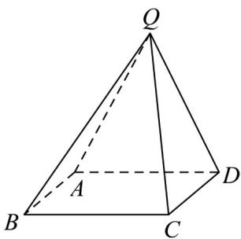

<!-- question-source:start -->
12．（2021·全国新Ⅱ卷·高考真题）在四棱锥 $Q - ABCD$ 中，底面 $ABCD$ 是正方形，若 $AD = 2, QD = QA = \sqrt{5}, QC = 3$ 。

<!-- question-source:end -->

![[高中/真题/按题型分类/专题21 立体几何大题综合/考点07_求二面角及最值或范围/真题/answers/Q00035938A1.md]]
