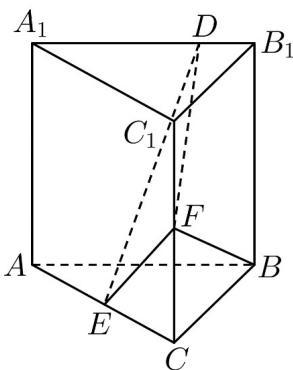

<!-- question-source:start -->
13．（2021·全国甲卷·高考真题）已知直三棱柱 $ABC-A_{1}B_{1}C_{1}$ 中，侧面 $AA_{1}B_{1}B$ 为正方形，AB=BC=2，
E, F 分别为 AC 和 $CC_{1}$ 的中点，D 为棱 $A_{1}B_{1}$ 上的点． $BF \perp A_{1}B_{1}$

(1) 证明： $BF \perp DE$ ;

(2) 当 $B_{1}D$ 为何值时，面 $BB_{1}C_{1}C$ 与面 DFE 所成的二面角的正弦值最小？
<!-- question-source:end -->

![[高中/真题/按题型分类/专题21 立体几何大题综合/考点07_求二面角及最值或范围/真题/answers/Q00035939A1.md]]
