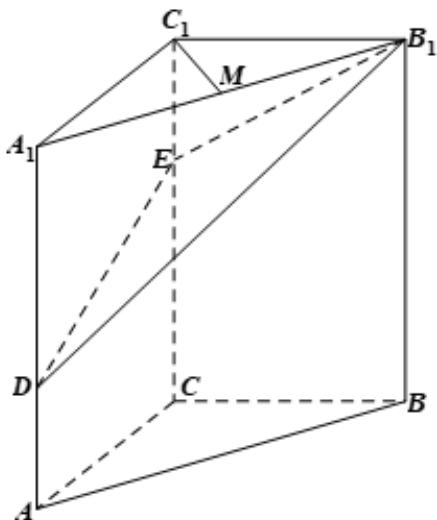

<!-- question-source:start -->
16. (2020·天津·高考真题) 如图, 在三棱柱 $ABC - A_1B_1C_1$ 中, $CC_1 \perp$ 平面 $ABC, AC \perp BC, AC = BC = 2$ , $CC_1 = 3$ , 点 $D$ , $E$ 分别在棱 $AA_1$ 和棱 $CC_1$ 上, 且 $AD = 1$ , $CE = 2$ , $M$ 为棱 $A_1B_1$ 的中点.

(Ⅰ) 求证： $C_{1}M \perp B_{1}D$ ；

(Ⅱ) 求二面角 $B - B_{1}E - D$ 的正弦值；

(Ⅲ) 求直线 AB 与平面 $DB_{1}E$ 所成角的正弦值.
<!-- question-source:end -->

![[高中/真题/按题型分类/专题21 立体几何大题综合/考点07_求二面角及最值或范围/真题/answers/Q00035942A1.md]]
