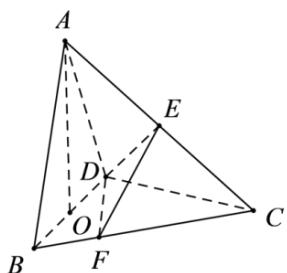

<!-- question-source:start -->
17. (2020·江苏·高考真题) 在三棱锥 $A - BCD$ 中，已知 $CB = CD = \sqrt{5}, BD = 2$ ， $O$ 为 $BD$ 的中点， $AO \perp$ 平面 $BCD$ ， $AO = 2$ ， $E$ 为 $AC$ 的中点。

<!-- question-source:end -->

![[高中/真题/按题型分类/专题21 立体几何大题综合/考点07_求二面角及最值或范围/真题/answers/Q00035943A1.md]]
