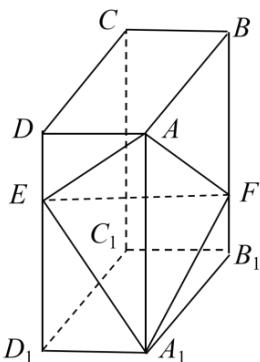

<!-- question-source:start -->
18．（2020·全国·高考真题）如图，在长方体 $ABCD - A_1B_1C_1D_1$ 中，点 $E,F$ 分别在棱 $DD_{1},BB_{1}$ 上，且 $2DE = ED_{1}$ ， $BF = 2FB_{1}$

(1) 证明：点 $C_1$ 在平面 $AEF$ 内；

(2) 若 $AB = 2$ ， $AD = 1$ ， $AA_{1} = 3$ ，求二面角 $A - EF - A_{1}$ 的正弦值.
<!-- question-source:end -->

![[高中/真题/按题型分类/专题21 立体几何大题综合/考点07_求二面角及最值或范围/真题/answers/Q00035944A1.md]]
