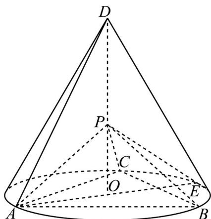

<!-- question-source:start -->
19. (2020·全国·高考真题) 如图, $D$ 为圆锥的顶点, $O$ 是圆锥底面的圆心, $AE$ 为底面直径, $AE = AD$ . $\triangle ABC$ 是底面的内接正三角形, $P$ 为 $DO$ 上一点, $PO = \frac{\sqrt{6}}{6} DO$ .

<!-- question-source:end -->

![[高中/真题/按题型分类/专题21 立体几何大题综合/考点07_求二面角及最值或范围/真题/answers/Q00035945A1.md]]
