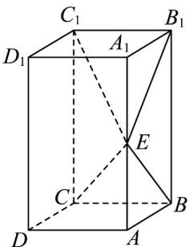

<!-- question-source:start -->
22．（2019·全国·高考真题）如图，长方体 $ABCD-A_{l}B_{l}C_{l}D_{l}$ 的底面ABCD是正方形，点E在棱 $AA_{l}$ 上， $BE\perp EC_{l}$

(1) 证明： $BE^{\perp}$ 平面 $EB_{l}C_{l}$ ;

(2) 若 $AE = A_{1}E$ ，求二面角 $B - EC - C_{1}$ 的正弦值.
<!-- question-source:end -->

![[高中/真题/按题型分类/专题21 立体几何大题综合/考点07_求二面角及最值或范围/真题/answers/Q00035948A1.md]]
