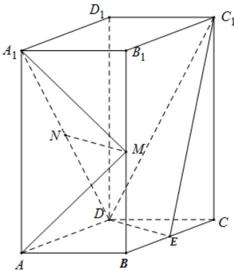

<!-- question-source:start -->
23.（2019·全国·高考真题）如图，直四棱柱 $ABCD - A_{1}B_{1}C_{1}D_{1}$ 的底面是菱形， $AA_{1} = 4$ ， $AB = 2$ ， $\angle BAD = 60^{\circ}$ ， $E, M, N$ 分别是 $BC, BB_{1}, A_{1}D$ 的中点。

(1) 证明： $MN^{\parallel}$ 平面 $C_{I}DE$ ;

(2) 求二面角 $A-MA_{1}-N$ 的正弦值.
<!-- question-source:end -->

![[高中/真题/按题型分类/专题21 立体几何大题综合/考点07_求二面角及最值或范围/真题/answers/Q00035949A1.md]]
