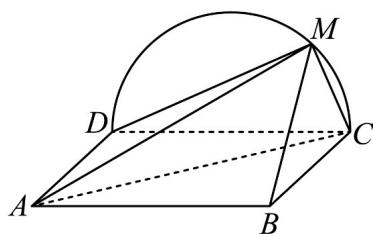

<!-- question-source:start -->
25. （2018·全国·高考真题）如图，边长为 $^{2}$ 的正方形 ABCD 所在的平面与半圆弧 CD 所在平面垂直，M 是 CD 上异于 C，D 的点。

(1) 证明：平面 $AMD \perp$ 平面 $BMC$ ；

(2) 当三棱锥 M-ABC 体积最大时，求面 MAB 与面 MCD 所成二面角的正弦值.

<!-- question-source:end -->

![[高中/真题/按题型分类/专题21 立体几何大题综合/考点07_求二面角及最值或范围/真题/answers/Q00035950A1.md]]
