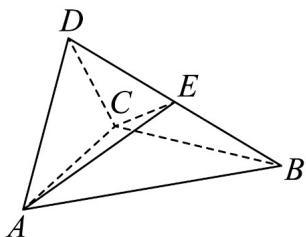

<!-- question-source:start -->
27. (2017·全国·高考真题) (2017 新课标全国Ⅲ理科) 如图, 四面体 $ABCD$ 中, $\triangle ABC$ 是正三角形, $\triangle ACD$ 是直角三角形, $\angle ABD = \angle CBD$ , $AB = BD$ .

(1) 证明：平面 $ACD \perp$ 平面 ABC；

(2) 过 $AC$ 的平面交 $BD$ 于点 $E$ , 若平面 $AEC$ 把四面体 $ABCD$ 分成体积相等的两部分, 求二面角 $D-AE-C$ 的余弦值.
<!-- question-source:end -->

![[高中/真题/按题型分类/专题21 立体几何大题综合/考点07_求二面角及最值或范围/真题/answers/Q00035952A1.md]]
