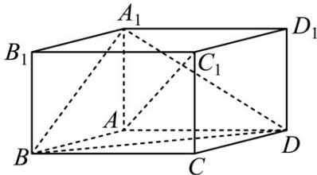

<!-- question-source:start -->
29. (2017·江苏·高考真题) 如图, 在平行六面体 $ABCD - A_1B_1C_1D_1$ 中, $AA_1 \perp$ 平面 $ABCD$ , 且 $AB = AD = 2$

$AA_{1}=\sqrt{3}$ , $\angle BAD=120^{\circ}$ .

(1)求异面直线 $A_{1}B$ 与 $AC_{1}$ 所成角的余弦值；

(2)求二面角 $B - A_{1}D - A$ 的正弦值.
<!-- question-source:end -->

![[高中/真题/按题型分类/专题21 立体几何大题综合/考点07_求二面角及最值或范围/真题/answers/Q00035954A1.md]]
