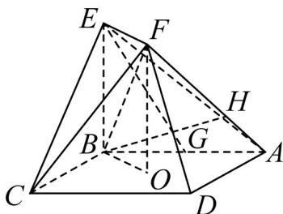

<!-- question-source:start -->
30．（2016·天津·高考真题）如图，正方形ABCD的中心为O，四边形OBEF为矩形，平面OBEF⊥平面ABCD，点G为AB的中点，AB=BE=2.

(Ⅰ) 求证：EG∥平面 ADF；

(Ⅱ) 求二面角 O-EF-C 的正弦值；

（Ⅲ）设 $^{H}$ 为线段AF上的点，且 $AH=\frac{2}{3}HF$ ，求直线BH和平面CEF所成角的正弦值.
<!-- question-source:end -->

![[高中/真题/按题型分类/专题21 立体几何大题综合/考点07_求二面角及最值或范围/真题/answers/Q00035955A1.md]]
