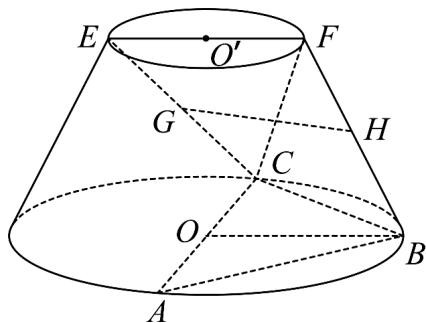

<!-- question-source:start -->
31. （2016·山东·高考真题）在如图所示的圆台中，AC 是下底面圆 O 的直径，EF 是上底面圆 O' 的直径，FB 是圆台的一条母线：

(Ⅰ) 已知 G,H 分别为 EC，FB 的中点，求证：GH∥平面 ABC；

(II) 已知 $EF = FB = \frac{1}{2} AC = 2\sqrt{3}$ ，AB = BC。求二面角 F - BC - A 的余弦值.
<!-- question-source:end -->

![[高中/真题/按题型分类/专题21 立体几何大题综合/考点07_求二面角及最值或范围/真题/answers/Q00035956A1.md]]
