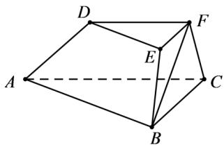

<!-- question-source:start -->
32．（2016·浙江·高考真题）如图，在三棱台ABC-DEF中，平面BCFE⊥平面ABC, $\angle ACB=90^{\circ},BC=2$ ，AC=3,BE=EF=FC=1.

(Ⅰ) 求证： $BF \perp$ 平面 ACFD；

(Ⅱ) 求二面角 B-AD-F 的平面角的余弦值.
<!-- question-source:end -->

![[高中/真题/按题型分类/专题21 立体几何大题综合/考点07_求二面角及最值或范围/真题/answers/Q00035957A1.md]]
