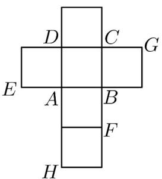
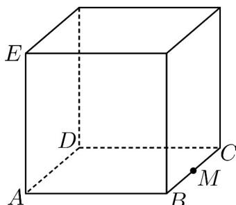

<!-- question-source:start -->
38. (2015·四川·高考真题) 一个正方体的平面展开图及该正方体的直观图的示意图如图所示，在正方体中，设 BC 的中点为 M，GH 的中点为 N

(1)请将字母 $F, G, H$ 标记在正方体相应的顶点处（不需说明理由）

(2)证明：直线 $MN / /$ 平面BDH

(3)求二面角 A - EG - M 的余弦值.
<!-- question-source:end -->

![[高中/真题/按题型分类/专题21 立体几何大题综合/考点07_求二面角及最值或范围/真题/answers/Q00035963A1.md]]
