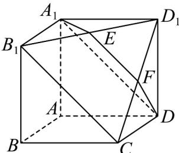

<!-- question-source:start -->
41. (2015·安徽·高考真题) 如图所示, 在多面体 $A_{1}B_{1}D_{1}DCBA$ , 四边形 $AA_{1}B_{1}B$ , $ADD_{1}A_{1}, ABCD$ 均为正方形, $E$ 为 $B_{1}D_{1}$ 的中点, 过 $A_{1}, D, E$ 的平面交 $CD_{1}$ 于 $\mathsf{F}$ .

(Ⅰ) 证明： $EF // B_{1}C$ ;

(Ⅱ) 求二面角 $E-A_{1}D-B_{1}$ 余弦值.
<!-- question-source:end -->

![[高中/真题/按题型分类/专题21 立体几何大题综合/考点07_求二面角及最值或范围/真题/answers/Q00035966A1.md]]
