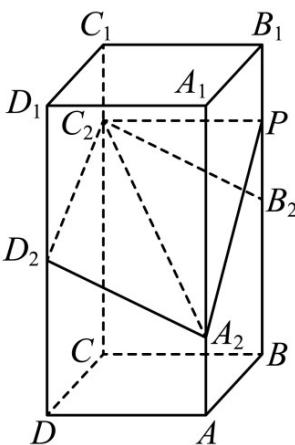

<!-- question-source:start -->
2．（2023·全国新I卷·高考真题）如图，在正四棱柱 $ABCD - A_1B_1C_1D_1$ 中， $AB = 2, AA_1 = 4$ 。点 $A_2, B_2, C_2, D_2$ 分别在棱 $AA_1, BB_1, CC_1, DD_1$ 上， $AA_2 = 1, BB_2 = DD_2 = 2, CC_2 = 3$ 。

<!-- question-source:end -->

![[高中/真题/按题型分类/专题21 立体几何大题综合/考点07_求二面角及最值或范围/真题/answers/Q00035970A1.md]]
