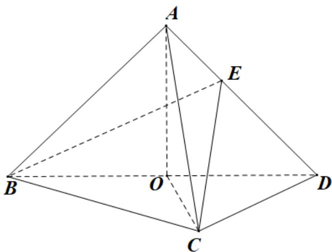

<!-- question-source:start -->
3．（2021·全国新I卷·高考真题）如图，在三棱锥 A-BCD 中，平面 $ABD \perp$ 平面 BCD ，AB = AD ，O 为 BD 的中点.

(1) 证明： $OA \perp CD$

(2) 若 $\triangle OCD$ 是边长为 1 的等边三角形，点 E 在棱 AD 上，DE = 2EA，且二面角 E - BC - D 的大小为 $45^{\circ}$ ，求三棱锥 A - BCD 的体积.
<!-- question-source:end -->

![[高中/真题/按题型分类/专题21 立体几何大题综合/考点07_求二面角及最值或范围/真题/answers/Q00035971A1.md]]
