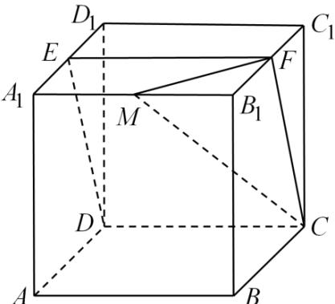

<!-- question-source:start -->
4．（2021·北京·高考真题）如图：在正方体 $ABCD-A_{1}B_{1}C_{1}D_{1}$ 中，E为 $A_{1}D_{1}$ 中点， $B_{1}C_{1}$ 与平面CDE交于点F．

(1) 求证：F 为 $B_{1}C_{1}$ 的中点；

(2) 点 $M$ 是棱 $A_{1}B_{1}$ 上一点，且二面角 $M - FC - E$ 的余弦值为 $\frac{\sqrt{5}}{3}$ ，求 $\frac{A_{1}M}{A_{1}B_{1}}$ 的值.
<!-- question-source:end -->

![[高中/真题/按题型分类/专题21 立体几何大题综合/考点07_求二面角及最值或范围/真题/answers/Q00035972A1.md]]
