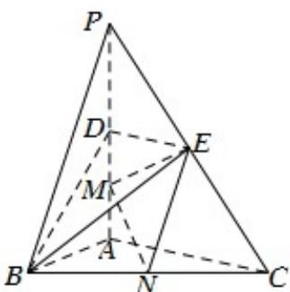

<!-- question-source:start -->
5．（2017·天津·高考真题）如图，在三棱锥 P-ABC 中， $PA \perp$ 底面 ABC ， $\angle BAC = 90^{\circ}$ ．点 D ，E ，N 分别为棱 PA ，PC ，BC 的中点，M 是线段 AD 的中点，PA = AC = 4 ，AB = 2．

(1) 求证： $MN \parallel$ 平面 BDE；

(2) 求二面角 C - EM - N 的正弦值；

(3) 已知点 $H$ 在棱 $PA$ 上，且直线 $NH$ 与直线 $BE$ 所成角的余弦值为 $\frac{\sqrt{7}}{21}$ ，求线段 $AH$ 的长.
<!-- question-source:end -->

![[高中/真题/按题型分类/专题21 立体几何大题综合/考点07_求二面角及最值或范围/真题/answers/Q00035973A1.md]]
