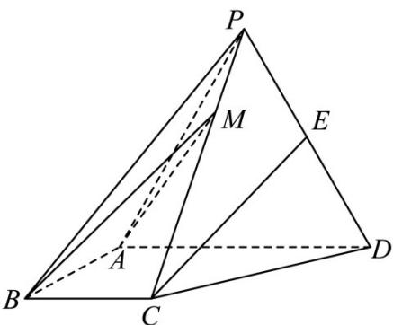

<!-- question-source:start -->
6. (2017·全国·高考真题) 如图, 四棱锥 P-ABCD 中, 侧面 PAD 是边长为 $^{2}$ 的等边三角形且垂直于底面 ABCD, AB = BC = $\frac{1}{2}$ AD, ∠BAD = ∠ABC = 90°, E 是 PD 的中点.

(1) 证明：直线 $CE \parallel$ 平面 $PAB$ ;

(2) 点 $M$ 在棱 $PC$ 上，且直线 $BM$ 与底面 $ABCD$ 所成角为 $45^{\circ}$ ，求二面角 $M - AB - D$ 的余弦值.

<!-- question-source:end -->

![[高中/真题/按题型分类/专题21 立体几何大题综合/考点07_求二面角及最值或范围/真题/answers/Q00035974A1.md]]
