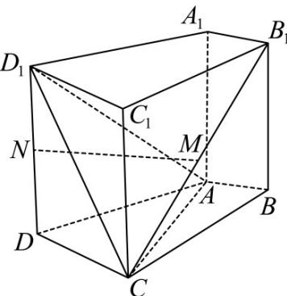

<!-- question-source:start -->
7. (2015·天津·高考真题) 如图, 在四棱柱 $ABCD - A_1B_1C_1D_1$ 中, 侧棱 $A_1A \perp$ 底面 $ABCD$ , $AB \perp AC$ , $AB = 1$ , $AC = AA_1 = 2$ , $AD = CD = \sqrt{5}$ , 且点 $M$ 和 $N$ 分别为 $B_1C$ 和 $D_1D$ 的中点.

(1) 求证： $MN \parallel$ 平面 ABCD；

(2) 求二面角 $D_{1}-AC-B_{1}$ 的正弦值；

(3) 设 $E$ 为棱 $A_{1}B_{1}$ 上的点，若直线 $NE$ 和平面 $ABCD$ 所成角的正弦值为 $\frac{1}{3}$ ，求线段 $A_{1}E$ 的长·
<!-- question-source:end -->

![[高中/真题/按题型分类/专题21 立体几何大题综合/考点07_求二面角及最值或范围/真题/answers/Q00035975A1.md]]
