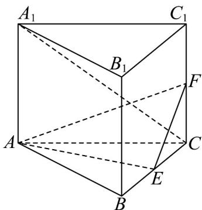

<!-- question-source:start -->
8. (2015·湖南·高考真题) 如图, 直三棱柱 $ABC - A_1B_1C_1$ 的底面是边长为 2 的正三角形, $E, F$ 分别是 $BC, CC_1$ 的中点.

(1) 证明：平面 $AEF \perp$ 平面 $B_{1}BCC_{1}$ ；

(2) 若直线 $A_{1}C$ 与平面 $A_{1}ABB_{1}$ 所成的角为 $45^{\circ}$ ，求三棱锥 $F - AEC$ 的体积.
<!-- question-source:end -->

![[高中/真题/按题型分类/专题21 立体几何大题综合/考点07_求二面角及最值或范围/真题/answers/Q00035976A1.md]]
