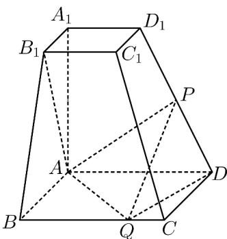

<!-- question-source:start -->
9. (2015·湖南·高考真题) 如图, 已知四棱台 $ABCD - A_1B_1C_1D_1$ 的上、下底面分别是边长为 3 和 6 的正方形, $A_1A = 6$ , 且 $A_1A \perp$ 底面 $ABCD$ , 点 $P, Q$ 分别在棱 $DD_1, BC$ 上.

<!-- question-source:end -->

![[高中/真题/按题型分类/专题21 立体几何大题综合/考点07_求二面角及最值或范围/真题/answers/Q00035977A1.md]]
