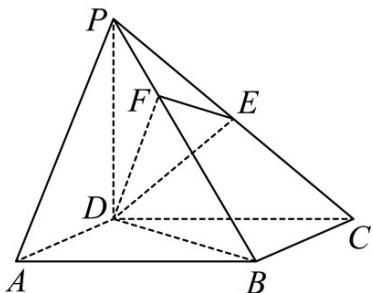

<!-- question-source:start -->
10. （2015·湖北·高考真题）《九章算术》中，将底面为长方形且有一条侧棱与底面垂直的四棱锥称之为

阳马，将四个面都为直角三角形的四面体称之为鳖臑。

如图，在阳马 $P - ABCD$ 中，侧棱 $PD \perp$ 底面 $ABCD$ ，且 $PD = CD$ ，过棱 $PC$ 的中点 $E$ ，作 $EF \perp PB$ 交 $PB$ 于点 $F$ ，连接 $DE, DF, BD, BE$ .

（Ⅰ）证明： $PB \perp$ 平面DEF．试判断四面体 $DBEF$ 是否为鳖臑，若是，写出其每个面的直角（只需写出结论）；若不是，说明理由；

(Ⅱ) 若面 $DEF$ 与面 $ABCD$ 所成二面角的大小为 $\frac{\pi}{3}$ ，求 $\frac{DC}{BC}$ 的值.
<!-- question-source:end -->

![[高中/真题/按题型分类/专题21 立体几何大题综合/考点07_求二面角及最值或范围/真题/answers/Q00035978A1.md]]
