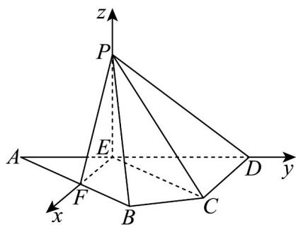

> [!faq]- 《专题21 立体几何大题综合》真题解析
>
> > [!success]- **【答案】** 详见解析
>
> > [!note]- **【分析】**
> > 【分析】（1）由题意，根据余弦定理求得 $EF = 2$ ，利用勾股定理的逆定理可证得 $EF \perp AD$ ，则 $EF \perp PE, EF \perp DE$ ，结合线面垂直的判定定理与性质即可证明；
> >
> > (2) 由 (1)，根据线面垂直的判定定理与性质可证明 $PE \perp ED$ ，建立如图空间直角坐标系 $E - xyz$ ，利用空间向量法求解面面角即可·
>
> > [!note]- **【解析】**
> > 【详解】（1）由 $AB = 8, AD = 5\sqrt{3}, AE = \frac{2}{5} AD, AF = \frac{1}{2} AB$
> > 得 $AE = 2\sqrt{3}, AF = 4$ ，又 $\angle BAD = 30^{\circ}$ ，在 $\triangle AEF$ 中，
> > 由余弦定理得 $EF = \sqrt{AE^{2} + AF^{2} - 2AE \cdot AF \cos \angle BAD} = \sqrt{16 + 12 - 2 \cdot 4 \cdot 2\sqrt{3} \cdot \frac{\sqrt{3}}{2}} = 2$ ,
> > 所以 $AE^2 + EF^2 = AF^2$ ，则 $AE \perp EF$ ，即 $EF \perp AD$
> > 所以 $EF \perp PE, EF \perp DE$ ，又 $PE \cap DE = E, PE, DE \subset$ 平面 $PDE$
> > 所以 $EF \perp$ 平面 PDE ，又 $PD \subset$ 平面 PDE ，
> > 故 $EF \perp PD$ ；
> > (2) 连接 $CE$ ，由 $\angle ADC = 90^{\circ}, ED = 3\sqrt{3}, CD = 3$ ，则 $CE^{2} = ED^{2} + CD^{2} = 36$
> > 在 $\triangle \mathrm{PEC}$ 中， $PC = 4\sqrt{3},PE = 2\sqrt{3},EC = 6$ ，得 $EC^2 +PE^2 = PC^2$
> > 所以 $PE \perp EC$ ，由（1）知 $PE \perp EF$ ，又 $EC \cap EF = E, EC, EF \subset$ 平面 $ABCD$
> > 所以 $PE \perp$ 平面ABCD，又 $ED \subset$ 平面ABCD
> > 所以 $PE \perp ED$ ，则 PE, EF, ED 两两垂直，建立如图空间直角坐标系 E - xyz，则 $E(0,0,0), P(0,0,2\sqrt{3}), D(0,3\sqrt{3},0), C(3,3\sqrt{3},0), F(2,0,0), A(0,-2\sqrt{3},0)$
> > 由 $F$ 是 $AB$ 的中点，得 $B(4,2\sqrt{3},0)$
> > 所以 $\overset{\mathrm{UUUU}}{PC} = (3, 3\sqrt{3}, -2\sqrt{3}), \overset{\mathrm{UUUU}}{PD} = (0, 3\sqrt{3}, -2\sqrt{3}), \overset{\mathrm{UUUU}}{PB} = (4, 2\sqrt{3}, -2\sqrt{3}), \overset{\mathrm{UUUU}}{PF} = (2, 0, -2\sqrt{3})$
> > 设平面 $PCD$ 和平面 $PBF$ 的一个法向量分别为 $n = (x_{1},y_{1},z_{1}),\stackrel {\sqcup}{m} = (x_{2},y_{2},z_{2})$
> > $$
> > \left\{\begin{array}{l}n \cdot P C = 3 x _ {1} + 3 \sqrt {3} y _ {1} - 2 \sqrt {3} z _ {1} = 0\\\rightarrow \square \square \square\\n \cdot P D = 3 \sqrt {3} y _ {1} - 2 \sqrt {3} z _ {1} = 0\end{array}, \quad \left\{\begin{array}{l}m \cdot P B = 4 x _ {2} + 2 \sqrt {3} y _ {2} - 2 \sqrt {3} z _ {2} = 0\\\rightarrow \square \square \square\\m \cdot P F = 2 x _ {2} - 2 \sqrt {3} z _ {2} = 0\end{array}\right. \right.
> > $$
> > 令 $y_{1}=2, x_{2}=\sqrt{3}$ ，得 $x_{1}=0, z_{1}=3, y_{2}=-1, z_{2}=1$ ，
> > 所以 $n = (0,2,3), m = (\sqrt{3}, -1,1)$
> > 所以 $\left|\cos m, n\right| = \frac{\left|m \cdot n\right|}{\left|m\right|\left|n\right|} = \frac{1}{\sqrt{5} \cdot \sqrt{13}} = \frac{\sqrt{65}}{65}$ ，
> > 设平面 $PCD$ 和平面 $PBF$ 所成角为 $\theta$ ，则 $\sin \theta = \sqrt{1 - \cos^2 \theta} = \frac{8\sqrt{65}}{65}$
> > 即平面 $PCD$ 和平面 $PBF$ 所成角的正弦值为 $\frac{8\sqrt{65}}{65}$ .
> > 
