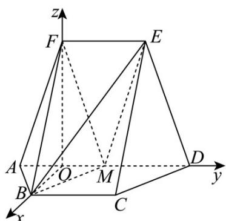

> [!faq]- 《专题21 立体几何大题综合》真题解析
>
> > [!success]- **【答案】** 详见解析
>
> > [!note]- **【分析】**
> > （1）结合已知易证四边形 BCDM 为平行四边形，可证 BM // CD ，进而得证；
> >
> > (2) 作 $BO \perp AD$ 交 $AD$ 于 $O$ ，连接 $OF$ ，易证 $OB, OD, OF$ 三垂直，采用建系法结合二面角夹角余弦公式即可求解。
>
> > [!note]- **【解析】**
> > （1）因为 $BC // AD, EF = 2, AD = 4, M$ 为 $AD$ 的中点，所以 $BC // MD, BC = MD$
> > 四边形 $BCDM$ 为平行四边形，所以 $BM // CD$ ，又因为 $BM \notin$ 平面 $CDE$
> > $CD \subset$ 平面 $CDE$ ，所以 $BM \parallel$ 平面 $CDE$ ；
> > (2) 如图所示，作 $BO \perp AD$ 交 $AD$ 于 $O$ ，连接 $OF$
> > 因为四边形 ABCD 为等腰梯形， $BC \parallel AD, AD = 4, AB = BC = 2$ ，所以 CD = 2，
> > 结合（1）BCDM 为平行四边形，可得 BM = CD = 2，又 AM = 2，
> > 所以 $\triangle ABM$ 为等边三角形， $O$ 为 $AM$ 中点，所以 $OB = \sqrt{3}$
> > 又因为四边形 ADEF 为等腰梯形，M 为 AD 中点，所以 EF = MD, EF // MD
> > 四边形 EFMD 为平行四边形，FM = ED = AF，
> > 所以 $\triangle AFM$ 为等腰三角形， $\triangle ABM$ 与 $\triangle AFM$ 底边上中点 $O$ 重合， $OF \perp AM$ ， $OF = \sqrt{AF^2 - AO^2} = 3$
> > 因为 $OB^{2} + OF^{2} = BF^{2}$ ，所以 $OB \perp OF$ ，所以 OB, OD, OF 互相垂直，
> > 以 $OB$ 方向为 $x$ 轴， $OD$ 方向为 $y$ 轴， $OF$ 方向为 $z$ 轴，建立 $O - xyz$ 空间直角坐标系，
> > $F(0,0,3)$ , $B(\sqrt{3},0,0),M(0,1,0),E(0,2,3)$ , $\overline{BM} = (-\sqrt{3},1,0),\overline{BF} = (-\sqrt{3},0,3)$
> > $\stackrel{\square\square}{BE}=\left(-\sqrt{3},2,3\right)$ ，设平面BFM的法向量为 $m=(x_{1},y_{1},z_{1})$
> > 平面 EMB 的法向量为 $n = (x_{2}, y_{2}, z_{2})$
> > 则 $\left\{ \begin{array}{l}m\cdot BM = 0\\ \rightarrow \\ m\cdot BF = 0 \end{array} \right.$ ，即 $\left\{ \begin{array}{ll} - \sqrt{3} x_1 + y_1 = 0\\ -\sqrt{3} x_1 + 3z_1 = 0 \end{array} \right.$ ，令 $x_{1} = \sqrt{3}$ ，得 $y_{1} = 3,z_{1} = 1$ ，即 $m = (\sqrt{3},3,1)$
> > 则 $\left\{ \begin{array}{l} n \cdot BM = 0 \\ \rightarrow \square \square \\ n \cdot BE = 0 \end{array} \right.$ ，即 $\left\{ \begin{array}{l} -\sqrt{3} x_2 + y_2 = 0 \\ -\sqrt{3} x_2 + 2y_2 + 3z_2 = 0 \end{array} \right.$ ，令 $x_2 = \sqrt{3}$ ，得 $y_2 = 3, z_2 = -1$ ，
> > 即 $n = (\sqrt{3}, 3, -1)$ ， $\cos m, n = \frac{\vec{m} \cdot n}{|m| \cdot |n|} = \frac{11}{\sqrt{13} \cdot \sqrt{13}} = \frac{11}{13}$ ，则 $\sin m, n = \frac{4\sqrt{3}}{13}$ ，
> > 故二面角 $F - BM - E$ 的正弦值为 $\frac{4\sqrt{3}}{13}$ .
> > 
