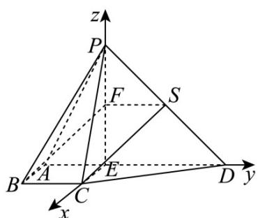

> [!faq]- 《专题21 立体几何大题综合》真题解析
>
> > [!success]- **【答案】** 详见解析
>
> > [!note]- **【分析】**
> > （1）取 $PD$ 的中点为 $\mathbb{S}$ ，接 $SF, SC$ ，可证四边形 $SFBC$ 为平行四边形，由线面平行的判定定理可得 $BF //$ 平面 $PCD$ .
> >
> > (2) 建立如图所示的空间直角坐标系，求出平面 $APB$ 和平面 $PCD$ 的法向量后可求夹角的余弦值.
>
> > [!note]- **【解析】**
> > （1）取 $PD$ 的中点为 $\mathrm{S}$ ，接 $SF, SC$ ，则 $SF // ED, SF = \frac{1}{2} ED = 1$
> > 而 $ED // BC, ED = 2BC$ ，故 $SF // BC, SF = BC$ ，故四边形 $SFBC$ 为平行四边形，
> > 故 $BF//SC$ ，而 $BF\not\subset$ 平面PCD， $SC\subset$ 平面PCD，
> > 所以 $BF \parallel$ 平面 PCD.
> > (2)
> > 
> > 因为 ED = 2 ，故 AE = 1 ，故 $AE \parallel BC, AE = BC$
> > 故四边形 AECB 为平行四边形，故 $CE \parallel AB$ ，所以 $CE \perp$ 平面 PAD
> > 而 $PE, ED \subset$ 平面 $PAD$ ，故 $CE \perp PE, CE \perp ED$ ，而 $PE \perp ED$
> > 故建立如图所示的空间直角坐标系，
> > 则 $A(0, - 1,0),B(1, - 1,0),C(1,0,0),D(0,2,0),P(0,0,2)$
> > 则 $\overline{PA} = (0, -1, -2), \overline{PB} = (1, -1, -2), \overline{PC} = (1, 0, -2), \overline{PD} = (0, 2, -2)$ ,
> > 设平面 $PAB$ 的法向量为 $m = (x, y, z)$
> > 则由 $\left\{\begin{aligned}m\cdot PA&=0\\ \rightarrow\square\square\square\square\end{aligned}\right.$ 可得 $\left\{\begin{aligned}-y-2z&=0\\ x-y-2z&=0\end{aligned}\right.$ ，取 $m=(0,-2,1)$ ，
> > 设平面 PCD 的法向量为 $n = (a, b, c)$ ,
> > 则由 $\left\{ \begin{array}{l} n \cdot PC = 0 \\ \rightarrow \square \square \\ n \cdot PD = 0 \end{array} \right.$ 可得 $\left\{ \begin{array}{l} a - 2b = 0 \\ 2b - 2c = 0 \end{array} \right.$ ，取 $n = (2,1,1)$ ，
> > 故 $\cos m, n = \frac{-1}{\sqrt{5} \times \sqrt{6}} = -\frac{\sqrt{30}}{30}$
> > 故平面 $PAB$ 与平面 $PCD$ 夹角的余弦值为 $\frac{\sqrt{30}}{30}$
