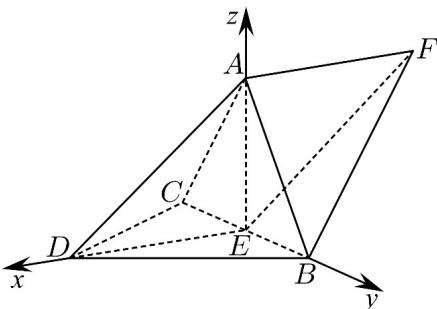

> [!faq]- 《专题21 立体几何大题综合》真题解析
>
> > [!success]- **【答案】** 详见解析
>
> > [!note]- **【分析】**
> > 【分析】（1）根据题意易证 $BC \perp$ 平面 ADE，从而证得 $BC \perp DA$ ；
> >
> > (2) 由题可证 $AE \perp$ 平面 $BCD$ ，所以以点 $E$ 为原点， $ED, EB, EA$ 所在直线分别为 $x, y, z$ 轴，建立空间直角坐标系，再求出平面 $ABD, ABF$ 的一个法向量，根据二面角的向量公式以及同角三角函数关系即可解出．【详解】（1）连接 $AE, DE$ ，因为 $E$ 为 $BC$ 中点， $DB = DC$ ，所以 $DE \perp BC$ ①，因为 $DA = DB = DC$ ， $\angle ADB = \angle ADC = 60^{\circ}$ ，所以 $\triangle ACD$ 与 $\triangle ABD$ 均为等边三角形， $\therefore AC = AB$ ，从而 $AE \perp BC$ ②，由①②， $AE \cap DE = E$ ， $AE, DE \subset$ 平面 $ADE$ ，所以， $BC \perp$ 平面 $ADE$ ，而 $AD \subset$ 平面 $ADE$ ，所以 $BC \perp DA$ ．（2）不妨设 $DA = DB = DC = 2$ ， $\because BD \perp CD$ ， $\therefore BC = 2\sqrt{2}, DE = AE = \sqrt{2}$ ： $\therefore AE^{2} + DE^{2} = 4 = AD^{2}$ ， $\therefore AE \perp DE$ ，又 $\because AE \perp BC, DE \cap BC = E$ ， $DE, BC \subset$ 平面 $BCD \therefore AE \perp$ 平面 $BCD$ 以点 $E$ 为原点， $ED, EB, EA$ 所在直线分别为 $x, y, z$ 轴，建立空间直角坐标系，如图所示：
> >
> > 
> >
> > 设 $D(\sqrt{2},0,0),A(0,0,\sqrt{2}),B(0,\sqrt{2},0),E(0,0,0)$
> >
> > 设平面 $DAB$ 与平面 $ABF$ 的一个法向量分别为 $\overline{n_1} = (x_1, y_1, z_1), \overline{n_2} = (x_2, y_2, z_2)$
> >
> > 二面角 $D - AB - F$ 平面角为 $\theta$ ，而 $\overline{AB} = (0, \sqrt{2}, -\sqrt{2})$
> >
> > 因为 $\stackrel{\mathrm{UUU}}{EF} = \stackrel{\mathrm{UUU}}{DA} = (-\sqrt{2},0,\sqrt{2})$ ，所以 $F(-\sqrt{2},0,\sqrt{2})$ ，即有 $\stackrel{\mathrm{UUU}}{AF} = (-\sqrt{2},0,0)$
> >
> > $\therefore \left\{ \begin{array}{l} -\sqrt{2} x_{1} + \sqrt{2} z_{1} = 0 \\ \sqrt{2} y_{1} - \sqrt{2} z_{1} = 0 \end{array} \right.$ ，取 $x_{1} = 1$ ，所以 $\square n_1 = (1,1,1)$
> >
> > $\left\{ \begin{array}{l} \sqrt{2} y_{2} - \sqrt{2} z_{2} = 0 \\ -\sqrt{2} x_{2} = 0 \end{array} \right.$ ，取 $y_{2} = 1$ ，所以 $n_{2} = (0,1,1)$
> >
> > 所以， $\left|\cos\theta\right|=\frac{\left|\begin{matrix}\square & \square \\ n_{1} & \cdot \\ \square & \square\end{matrix}\right|}{\left|\begin{matrix}n_{1}\\ n_{1}\end{matrix}\right|\left|\begin{matrix}n_{2}\\ n_{2}\end{matrix}\right|}=\frac{2}{\sqrt{3}\times\sqrt{2}}=\frac{\sqrt{6}}{3}$ ，从而 $\sin\theta=\sqrt{1-\frac{6}{9}}=\frac{\sqrt{3}}{3}$
> >
> > 所以二面角 $D - AB - F$ 的正弦值为 $\frac{\sqrt{3}}{3}$
>
> > [!note]- **【解析】**
> > 本题未单列解析。
