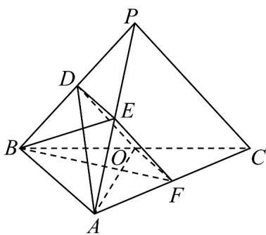
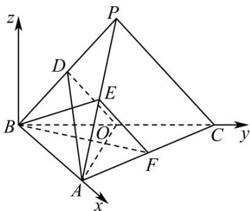
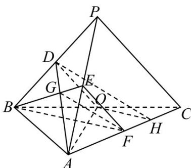

> [!faq]- 《专题21 立体几何大题综合》真题解析
>
> > [!success]- **【答案】** 详见解析
>
> > [!note]- **【分析】**
> > 【分析】（ $^{1}$ ）根据给定条件，证明四边形 ODEF 为平行四边形，再利用线面平行的判定推理作答·
> >
> > (2) 法一：由 (1) 的信息，结合勾股定理的逆定理及线面垂直、面面垂直的判定推理作答·法二：过点 B
> >
> > 作轴平面，建立如图所示的空间直角坐标系，设 $P(x,y,z)$ 所以由 $\left\{ \begin{array}{ll}PA = \sqrt{14}\\ PB = \sqrt{6}\\ PC = \sqrt{6} \end{array} \right.$ 求出点坐标，再
> >
> > 求出平面 ADO 与平面 BEF 的法向量 $n_{1}, n_{2}$ ，由 $n_{1} \cdot n_{2} = 0$ 即可证明；
> >
> > （3）法一：由（2）的信息作出并证明二面角的平面角，再结合三角形重心及余弦定理求解作答·法二：求出平面 $ADO$ 与平面 $ACO$ 的法向量，由二面角的向量公式求解即可·
>
> > [!note]- **【解析】**
> > 【详解】（1）连接 $DE, OF$ ，设 $AF = tAC$ ，则 $\overline{BF} = \overline{BA} + \overline{AF} = (1 - t)\overline{BA} + t\overline{BC}$ ， $AO = -\overline{BA} + \frac{1}{2}\overline{BC}$
> > $$
> > B F \perp A O
> > $$
> > 则 $BF\cdot AO = [(1 - t)BA + tBC]\cdot (-BA + \frac{1}{2} BC) = (t - 1)BA^2 +\frac{1}{2} tBC^2 = 4(t - 1) + 4t = 0$
> > 解得 $t = \frac{1}{2}$ ，则 $F$ 为 $AC$ 的中点，由 $D,E,O,F$ 分别为 $PB,PA,BC,AC$ 的中点，
> > 
> > 于是 $DE // AB, DE = \frac{1}{2} AB, OF // AB, OF = \frac{1}{2} AB$ ，即 $DE // OF, DE = OF$ ，则四边形 $ODEF$ 为平行四边形， $EF // DO, EF = DO$ ，又 $EF \notin$ 平面 $ADO, DO \subset$ 平面 $ADO$ ，
> > 所以 EF // 平面 ADO .
> > (2) 法一：由 (1) 可知 $EF // OD$ ，则 $AO = \sqrt{6}, DO = \frac{\sqrt{6}}{2}$ ，得 $AD = \sqrt{5}DO = \frac{\sqrt{30}}{2}$ ，
> > 因此 $OD^{2} + AO^{2} = AD^{2} = \frac{15}{2}$ ，则 $OD \perp AO$ ，有 $EF \perp AO$ ，
> > 又 $AO \perp BF, BF \cap EF = F$ ， $BF, EF \subset$ 平面 BEF，
> > 则有 $AO \perp$ 平面 BEF，又 $AO \subset$ 平面 ADO，所以平面 $ADO \perp$ 平面 BEF。
> > 法二：因为 $AB \perp BC$ ，过点 B 作 z 轴 $\perp$ 平面 BAC，建立如图所示的空间直角坐标系， $A(2,0,0,)$ , $B(0,0,0)$ , $C(0,2\sqrt{2},0)$ ,
> > 在 $\triangle BDA$ 中， $\cos \angle PBA = \frac{DB^2 + AB^2 - DA^2}{2DB \cdot AB} = \frac{\frac{3}{2} + 4 - \frac{15}{2}}{2 \times 2 \times \frac{\sqrt{6}}{2}} = -\frac{1}{\sqrt{6}}$
> > 在 $\triangle PBA$ 中， $PA^2 = PB^2 + AB^2 - 2PB \cdot AB \cos \angle PBA = 6 + 4 - 2\sqrt{6} \times 2 \times \left(-\frac{1}{\sqrt{6}}\right) = 14$
> > 设，所以由 $\left\{\begin{aligned}PA&=\sqrt{14}\\ PB&=\sqrt{6}\\ PC&=\sqrt{6}\end{aligned}\right.$ 可得： $\left\{\begin{aligned}(x-2)^{2}+y^{2}+z^{2}&=14\\ x^{2}+y^{2}+z^{2}&=6\\ x^{2}+\left(y-2\sqrt{2}\right)^{2}+z^{2}&=6\end{aligned}\right.$
> > 可得： $x = -1,y = \sqrt{2},z = \sqrt{3}$ ，所以 $P\left(-1,\sqrt{2},\sqrt{3}\right)$
> > 则 $D\left(-\frac{1}{2}, \frac{\sqrt{2}}{2}, \frac{\sqrt{3}}{2}\right)$ ，所以 $E\left(\frac{1}{2}, \frac{\sqrt{2}}{2}, \frac{\sqrt{3}}{2}\right)$ ， $F(1, \sqrt{2}, 0)$ ，
> > $\overrightarrow{AO}=\left(-2,\sqrt{2},0\right),\overrightarrow{AD}=\left(-\frac{5}{2},\frac{\sqrt{2}}{2},\frac{\sqrt{3}}{2}\right)$
> > 设平面 ADO 的法向量为 $n_{1} = (x_{1}, y_{1}, z_{1})$
> > 则 $\left\{ \begin{array}{l} \square \quad \square \sqcup \sqcup \\ n_1 \cdot AQ = 0 \\ \square \quad \square \square \\ n_1 \cdot AD = 0 \end{array} \right.$ ，得 $\left\{ \begin{array}{l} -2x_1 + \sqrt{2}y_1 = 0 \\ -\frac{5}{2}x_1 + \frac{\sqrt{2}}{2}y_1 + \frac{\sqrt{3}}{2}z_1 = 0 \end{array} \right.$ ，
> > 令 $x_{1} = 1$ ，则 $y_{1} = \sqrt{2},z_{1} = \sqrt{3}$ ，所以 $\stackrel {\sqcup}{n_1} = (1,\sqrt{2},\sqrt{3})$
> > $$
> > \stackrel {\square \square \square} {B E} = \left(\frac {1}{2}, \frac {\sqrt {2}}{2}, \frac {\sqrt {3}}{2}\right), \stackrel {\square \square \square} {B F} = (1, \sqrt {2}, 0)
> > $$
> > 设平面 BEF 的法向量为 $n_{2} = (x_{2}, y_{2}, z_{2})$
> > 则 $\left\{ \begin{array}{l} n_{\bullet} \cdot BE = 0 \\ n_{2} \cdot BF = 0 \end{array} \right.$ ，得 $\left\{ \begin{array}{l} \frac{1}{2} x_{2} + \frac{\sqrt{2}}{2} y_{2} + \frac{\sqrt{3}}{2} z_{2} = 0 \\ x_{2} + \sqrt{2} y_{2} = 0 \end{array} \right.$
> > 令 $x_{2} = 2$ ，则 $y_{2} = -\sqrt{2},z_{2} = 0$ ，所以 $\overline{n_2} = (2, - \sqrt{2},0)$
> > $$
> > n _ {1} \cdot n _ {2} = 2 \times 1 + \sqrt {2} \times (- \sqrt {2}) + 0 = 0
> > $$
> > 所以平面 $ADO \perp$ 平面 BEF；
> > 
> > (3) 法一：过点 O 作 $OH \parallel BF$ 交 AC 于点 H，设 $AD \cap BE = G$
> > 由 $AO \perp BF$ ，得 $HO \perp AO$ ，且 $FH = \frac{1}{3} AH$
> > 又由（2）知， $OD \perp AO$ ，则 $\angle DOH$ 为二面角 D-AO-C 的平面角，
> > 因为 $D, E$ 分别为 $PB, PA$ 的中点，因此 $G$ 为 $\triangle PAB$ 的重心，
> > 即有 $DG = \frac{1}{3} AD, GE = \frac{1}{3} BE$ ，又 $FH = \frac{1}{3} AH$ ，即有 $DH = \frac{3}{2} GF$
> > $\cos \angle ABD = \frac{4 + \frac{3}{2} - \frac{15}{2}}{2 \times 2 \times \frac{\sqrt{6}}{2}} = \frac{4 + 6 - PA^2}{2 \times 2 \times \sqrt{6}}$ ，解得 $PA = \sqrt{14}$ ，同理得 $BE = \frac{\sqrt{6}}{2}$ ，
> > 于是 $BE^{2} + EF^{2} = BF^{2} = 3$ ，即有 $BE \perp EF$ ，则 $GF^{2} = \left(\frac{1}{3} \times \frac{\sqrt{6}}{2}\right)^{2} + \left(\frac{\sqrt{6}}{2}\right)^{2} = \frac{5}{3}$
> > 从而 $GF = \frac{\sqrt{15}}{3}$ ， $DH = \frac{3}{2} \times \frac{\sqrt{15}}{3} = \frac{\sqrt{15}}{2}$ ，
> > 在 $\triangle DOH$ 中， $OH = \frac{1}{2} BF = \frac{\sqrt{3}}{2}, OD = \frac{\sqrt{6}}{2}, DH = \frac{\sqrt{15}}{2}$ ，
> > 于是 $\cos \angle DOH = \frac{\frac{6}{4} + \frac{3}{4} - \frac{15}{4}}{2 \times \frac{\sqrt{6}}{2} \times \frac{\sqrt{3}}{2}} = -\frac{\sqrt{2}}{2}$ ， $\sin \angle DOH = \sqrt{1 - \left(-\frac{\sqrt{2}}{2}\right)^2} = \frac{\sqrt{2}}{2}$ ，
> > 所以二面角 $D - AO - C$ 的正弦值为 $\frac{\sqrt{2}}{2}$
> > 
> > 法二：平面 ADO 的法向量为 $n_{1}^{\square}=\left(1,\sqrt{2},\sqrt{3}\right)$
> > 平面 ACO 的法向量为 $n_{3}^{山} = (0, 0, 1)$
> > 所以 $\cos n_{1}, n_{3} = \frac{n_{1} \cdot n_{2}}{|n_{1}| \cdot |n_{3}|} = \frac{\sqrt{3}}{\sqrt{1 + 2 + 3}} = \frac{\sqrt{2}}{2}$
> > 因为 $\vec{n}_1, \vec{n}_3 \in [0, \pi]$ ，所以 $\sin n_1, n_3 = \sqrt{1 - \cos^2 n_1, n_3} = \frac{\sqrt{2}}{2}$
> > 故二面角 $D - AO - C$ 的正弦值为 $\frac{\sqrt{2}}{2}$
