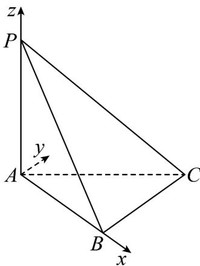

> [!faq]- 《专题21 立体几何大题综合》真题解析
>
> > [!success]- **【答案】** 详见解析
>
> > [!note]- **【分析】**
> > 【分析】（1）先由线面垂直的性质证得 $PA \perp BC$ ，再利用勾股定理证得 $BC \perp PB$ ，从而利用线面垂直的判定定理即可得证；
> >
> > (2) 结合 (1) 中结论, 建立空间直角坐标系, 分别求得平面 $PAC$ 与平面 $PBC$ 的法向量, 再利用空间向量夹角余弦的坐标表示即可得解.
>
> > [!note]- **【解析】**
> > 【详解】（1）因为 $PA \perp$ 平面 $ABC, BC \subset$ 平面 ABC
> > 所以 $PA \perp BC$ ，同理 $PA \perp AB$
> > 所以 $\triangle PAB$ 为直角三角形，
> > 又因为 $PB = \sqrt{PA^2 + AB^2} = \sqrt{2}$ ， $BC = 1, PC = \sqrt{3}$
> > 所以 $PB^{2} + BC^{2} = PC^{2}$ ，则 $\triangle \mathrm{PBC}$ 为直角三角形，故 $BC\perp PB$
> > 又因为 $BC \perp PA$ ， $PA \cap PB = P$
> > 所以 $BC \perp$ 平面 PAB.
> > (2) 由 (1) $BC \perp$ 平面 $PAB$ ，又 $AB \subset$ 平面 $PAB$ ，则 $BC \perp AB$
> > 
> > 以 A 为原点，AB 为 x 轴，过 A 且与 BC 平行的直线为 y 轴，AP 为 z 轴，建立空间直角坐标系，如图，
> > 则 $A(0,0,0), P(0,0,1), C(1,1,0), B(1,0,0)$
> > 所以 $\overline{AP}=(0,0,1),\overline{AC}=(1,1,0),\overline{BC}=(0,1,0),\overline{PC}=(1,1,-1)$
> > 设平面 $PAC$ 的法向量为 $\square m = (x_1, y_1, z_1)$ ，则 $\left\{ \begin{array}{l} m \cdot AP = 0 \\ m \cdot AC = 0 \end{array} \right.$ ，即 $\left\{ \begin{array}{l} z_1 = 0, \\ x_1 + y_1 = 0, \end{array} \right.$
> > 令 $x_{1}=1$ ，则 $y_{1}=-1$ ，所以 $m=(1,-1,0)$ ，
> > 设平面 $PBC$ 的法向量为 $n = (x_{2},y_{2},z_{2})$ ，则 $\left\{ \begin{array}{l}n\cdot \overline{BC} = 0\\ n\cdot PC = 0 \end{array} \right.$ ，即 $\left\{ \begin{array}{l}y_2 = 0\\ x_2 + y_2 - z_2 = 0 \end{array} \right.$
> > 令 $x_{2} = 1$ ，则 $z_{2} = 1$ ，所以 $n = (1,0,1)$
> > 所以 $\cos\left\langle\vec{m},n\right\rangle=\frac{\vec{m}\cdot n}{\left|\vec{m}\right|\left|n\right|}=\frac{1}{\sqrt{2}\times\sqrt{2}}=\frac{1}{2}$
> > 又因为二面角 A - PC - B 为锐二面角，
> > 所以二面角 A - PC - B 的大小为 $\frac{\pi}{3}$ .
