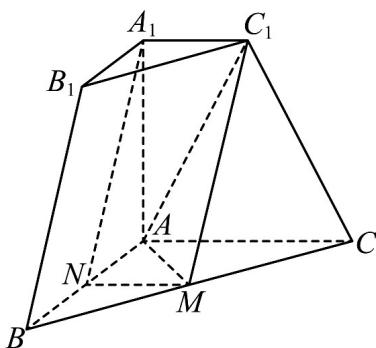
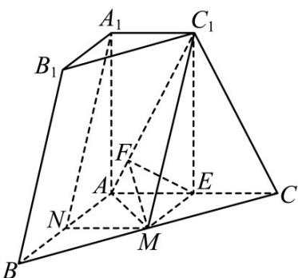
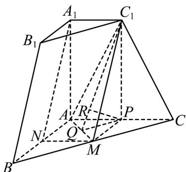
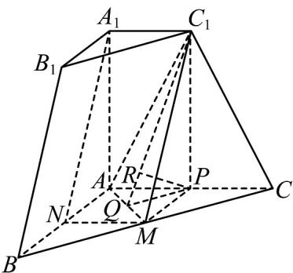

> [!faq]- 《专题21 立体几何大题综合》真题解析
>
> > [!success]- **【答案】** 详见解析
>
> > [!note]- **【分析】**
> > （1）先证明四边形 $MNA_{1}C_{1}$ 是平行四边形，然后用线面平行的判定解决；
> >
> > (2) 利用二面角的定义，作出二面角的平面角后进行求解；
> >
> > (3) 方法一是利用线面垂直的关系，找到垂线段的长，方法二无需找垂线段长，直接利用等体积法求解
>
> > [!note]- **【解析】**
> > （1）
> > 
> > 连接 $MN, C_1A \cdot$ 由 $M, N$ 分别是 $BC, BA$ 的中点，根据中位线性质， $MN // AC$ ，且 $MN = \frac{AC}{2} = 1$
> > 由棱台性质， $A_{1}C_{1}//AC$ ，于是 $MN//A_{1}C_{1}$ ，由 $MN=A_{1}C_{1}=1$ 可知，四边形 $MNA_{1}C_{1}$ 是平行四边形，则 $A_{1}N//MC_{1}$ ，
> > 又 $A_{1}N\not\subset$ 平面 $C_1MA$ ， $MC_{1}\subset$ 平面 $C_1MA$ ，于是 $A_{1}N//$ 平面 $AMC_{1}$
> > (2) 过 M 作 $ME \perp AC$ ，垂足为 E，过 E 作 $EF \perp AC_{1}$ ，垂足为 F，连接 $MF, C_{1}E$ .
> > 由 $ME \subset$ 面 ABC， $A_{1}A \perp$ 面 ABC，故 $AA_{1} \perp ME$ ，又 $ME \perp AC$ ， $AC \cap AA_{1} = A$ ， $AC, AA_{1} \subset$ 平面 $ACC_{1}A_{1}$ ，则 $ME \perp$ 平面 $ACC_{1}A_{1}$ .
> > 由 $AC_{1} \subset$ 平面 $ACC_{1}A_{1}$ ，故 $ME \perp AC_{1}$ ，又 $EF \perp AC_{1}$ ， $ME \cap EF = E$ ， $ME, EF \subset$ 平面 MEF，于是 $AC_{1} \perp$ 平面 MEF，
> > 由 $MF \subset$ 平面 $MEF$ ，故 $AC_{1} \perp MF$ ·于是平面 $AMC_{1}$ 与平面 $ACC_{1}A_{1}$ 所成角即 $\angle MFE$ .
> > 又 $ME = \frac{AB}{2} = 1$ ， $\cos \angle CAC_{1} = \frac{1}{\sqrt{5}}$ ，则 $\sin \angle CAC_{1} = \frac{2}{\sqrt{5}}$ ，故 $EF = 1\times \sin \angle CAC_{1} = \frac{2}{\sqrt{5}}$ ，在Rt△MEF中，
> > $\angle MEF = 90^{\circ}$ ，则 $MF = \sqrt{1 + \frac{4}{5}} = \frac{3}{\sqrt{5}}$
> > 于是 $\cos\angle MFE=\frac{EF}{MF}=\frac{2}{3}$
> > 
> > (3) [方法一：几何法]
> > 
> > 过 $C_1$ 作 $C_1P \perp AC$ ，垂足为 $P$ ，作 $C_1Q \perp AM$ ，垂足为 $Q$ ，连接 $PQ, PM$ ，过 $P$ 作 $PR \perp C_1Q$ ，垂足为 $R$ 。
> > 由题干数据可得， $C_{1}A=C_{1}C=\sqrt{5}$ ， $C_{1}M=\sqrt{C_{1}P^{2}+PM^{2}}=\sqrt{5}$ ，根据勾股定理， $C_{1}Q=\sqrt{5-\left(\frac{\sqrt{2}}{2}\right)^{2}}=\frac{3\sqrt{2}}{2}$ 由 $C_1P \perp$ 平面 $AMC$ ， $AM \subset$ 平面 $AMC$ ，则 $C_1P \perp AM$ ，又 $C_1Q \perp AM$ ， $C_1Q \cap C_1P = C_1$ ， $C_1Q, C_1P \subset$ 平面 $C_1PQ$ ，于是 $AM \perp$ 平面 $C_1PQ$ .
> > 又 $PR \subset$ 平面 $C_1PQ$ ，则 $PR \perp AM$ ，又 $PR \perp C_1Q$ ， $C_1Q \cap AM = Q$ ， $C_1Q, AM \subset$ 平面 $C_1MA$ ，故 $PR \perp$ 平面 $C_1MA$ .
> > 在中， $PR=\frac{PC_{1}\cdot PQ}{QC_{1}}=\frac{2\cdot\frac{\sqrt{2}}{2}}{\frac{3\sqrt{2}}{2}}=\frac{2}{3}$
> > 又 $CA = 2PA$ ，故点 $C$ 到平面 $C_1MA$ 的距离是 $P$ 到平面 $C_1MA$ 的距离的两倍，
> > 即点 C 到平面 $AMC_{1}$ 的距离是 $\frac{4}{3}$ .
> > [方法二：等体积法]
> > 
> > 辅助线同方法一·
> > 设点 C 到平面 $AMC_{1}$ 的距离为 h.
> > $$
> > V _ {C _ {1} - A M C} = \frac {1}{3} \times C _ {1} P \times S _ {\triangle A M C} = \frac {1}{3} \times 2 \times \frac {1}{2} \times (\sqrt {2}) ^ {2} = \frac {2}{3},
> > $$
> > $$
> > V _ {C - C _ {1} M A} = \frac {1}{3} \times h \times S _ {\triangle A M C _ {1}} = \frac {1}{3} \times h \times \frac {1}{2} \times \sqrt {2} \times \frac {3 \sqrt {2}}{2} = \frac {h}{2}.
> > $$
> > 由 $V_{C_{1}-AMC}=V_{C-C_{1}MA}\Leftrightarrow\frac{h}{2}=\frac{2}{3}$ ，即 $h=\frac{4}{3}$ .
