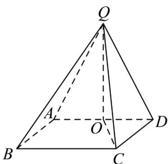
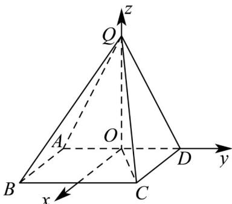

> [!faq]- 《专题21 立体几何大题综合》真题解析
>
> > [!success]- **【答案】** 详见解析
>
> > [!note]- **【分析】**
> > 【分析】（1）取 AD 的中点为 O，连接 QO, CO，可证 $QO \perp$ 平面 ABCD，从而得到面 $QAD \perp$ 面 ABCD.
> >
> > (2) 在平面 $ABCD$ 内，过 $O$ 作 $OT // CD$ ，交 $BC$ 于 $T$ ，则 $OT \perp AD$ ，建如图所示的空间坐标系，求出平面 $QAD$ 、平面 $BQD$ 的法向量后可求二面角的余弦值.
>
> > [!note]- **【解析】**
> > 【详解】
> > 
> > (1) 取 AD 的中点为 O，连接 QO, CO.
> > 因为 QA = QD ，OA = OD ，则 $QO \perp AD$ ，
> > 而 $AD = 2, QA = \sqrt{5}$ ，故 $QO = \sqrt{5 - 1} = 2$ 。
> > 在正方形 ABCD 中，因为 AD = 2 ，故 DO = 1 ，故 $CO = \sqrt{5}$
> > 因为 $QC = 3$ ，故 $QC^2 = QO^2 + OC^2$ ，故 $\triangle QOC$ 为直角三角形且 $QO \perp OC$
> > 因为 $OC \cap AD = O$ ，故 $QO \perp$ 平面 ABCD
> > 因为 $QO \subset$ 平面 $QAD$ ，故平面 $QAD \perp$ 平面 $ABCD$ .
> > (2) 在平面 $ABCD$ 内，过 $O$ 作 $OT \parallel CD$ ，交 $BC$ 于 $T$ ，则 $OT \perp AD$
> > 结合（1）中的 $QO \perp$ 平面ABCD，故可建如图所示的空间坐标系
> > 
> > 则 $D(0,1,0), Q(0,0,2), B(2,-1,0)$ ，故 $BQ = (-2,1,2), BD = (-2,2,0)$ .
> > 设平面 $QBD$ 的法向量 $n = (x, y, z)$
> > 则 $\left\{\begin{aligned}n\cdot\stackrel{\square\square}{B}Q&=0\\ n\cdot BD&=0\end{aligned}\right.$ 即 $\left\{\begin{aligned}-2x+y+2z&=0\\ -2x+2y&=0\end{aligned}\right.$ ，取 x=1，则 $y=1,z=\frac{1}{2}$ ，
> > 故 $\vec{n}=\left(1,1,\frac{1}{2}\right)$ .
> > 而平面 $QAD$ 的法向量为 $\square m = (1,0,0)$ ，故 $\cos \left\langle m,n\right\rangle = \frac{1}{1\times\frac{3}{2}} = \frac{2}{3}$ 。
> > 二面角 B-QD-A 的平面角为锐角，故其余弦值为 $\frac{2}{3}$
