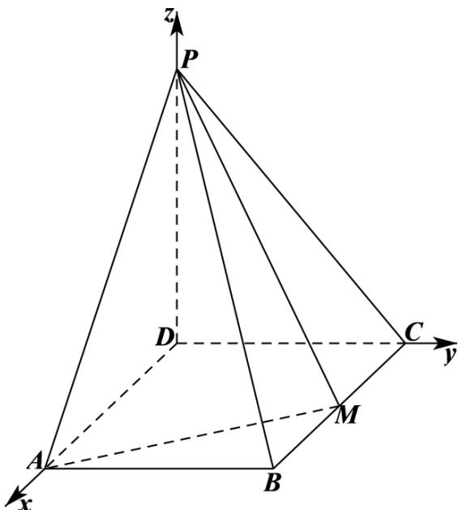
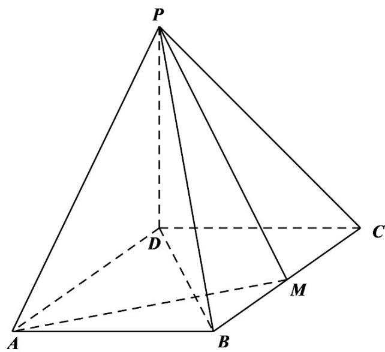
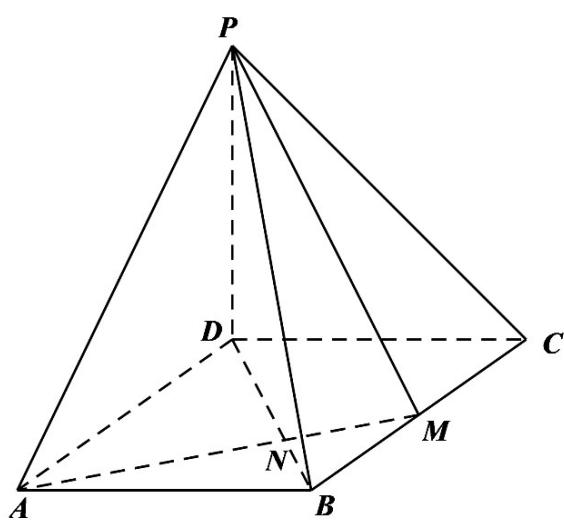
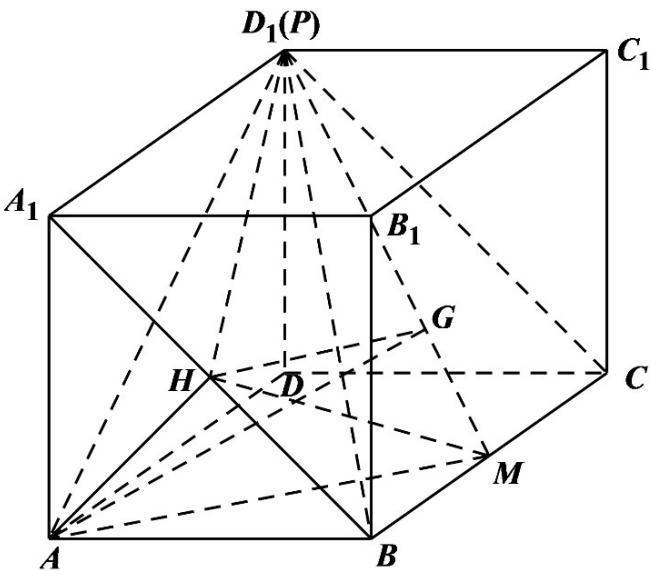

> [!faq]- 《专题21 立体几何大题综合》真题解析
>
> > [!success]- **【答案】** 详见解析
>
> > [!note]- **【分析】**
> > （1）以点 $D$ 为坐标原点， $DA$ 、 $DC$ 、 $DP$ 所在直线分别为 $x$ 、 $y$ 、 $z$ 轴建立空间直角坐标系，设 $BC = 2a$ ，由已知条件得出 $\overline{PB} \cdot \overline{AM} = 0$ ，求出 $a$ 的值，即可得出 $BC$ 的长；
> >
> > (2) 求出平面 $PAM$ 、 $PBM$ 的法向量，利用空间向量法结合同角三角函数的基本关系可求得结果·
>
> > [!note]- **【解析】**
> > （1）[方法一]：空间坐标系+空间向量法
> > ∵ $PD \perp$ 平面 ABCD ，四边形 ABCD 为矩形，不妨以点 D 为坐标原点，DA、DC、DP 所在直线分别为 x、
> > y、z轴建立如下图所示的空间直角坐标系D-xyz
> > 
> > 设 $BC = 2a$ ，则 $D(0,0,0)$ 、 $P(0,0,1)$ 、 $B(2a,1,0)$ 、 $M(a,1,0)$ 、 $A(2a,0,0)$ ，则 $\overline{PB} = (2a,1,-1)$ ， $\overline{AM} = (-a,1,0)$
> > $\because PB \perp AM$ ，则 $PB \cdot AM = -2a^2 + 1 = 0$ ，解得 $a = \frac{\sqrt{2}}{2}$ ，故 $BC = 2a = \sqrt{2}$ ；
> > [方法二]【最优解】：几何法 $^{+}$ 相似三角形法
> > 如图，连结 $BD$ 。因为 $PD \perp$ 底面 $ABCD$ ，且 $AM \subset$ 底面 $ABCD$ ，所以 $PD \perp AM$ 。
> > 又因为 $PB \perp AM$ ， $PB \cap PD = P$ ，所以 $AM \perp$ 平面 $PBD$ 。
> > 又 $BD \subset$ 平面 $PBD$ ，所以 $AM \perp BD$ 。
> > 
> > 从而 $\angle ADB + \angle DAM = 90^{\circ}$
> > 因为 $\angle MAB + \angle DAM = 90^{\circ}$ ，所以 $\angle MAB = \angle ADB$
> > 所以 $\triangle ADB - \triangle BAM$ ，于是 $\frac{AD}{AB} = \frac{BA}{BM}$
> > 所以 $\frac{1}{2} BC^2 = 1$ . 所以 $BC = \sqrt{2}$
> > [方法三]：几何法 $^{+}$ 三角形面积法
> > 如图，联结 $BD$ 交 $AM$ 于点 $N$ ：
> > 
> > 由[方法二]知 $AM \perp DB$
> > 在矩形 $ABCD$ 中，有 $\triangle DAN - \triangle BMN$ ，所以 $\frac{AN}{MN} = \frac{DA}{BM} = 2$ ，即 $AN = \frac{2}{3} AM$
> > 令 $BC = 2t(t > 0)$ ，因为 $M$ 为 $BC$ 的中点，则 $BM = t$ ， $DB = \sqrt{4t^2 + 1}$ ， $AM = \sqrt{t^2 + 1}$
> > 由 $S_{\triangle DAB} = \frac{1}{2} DA \cdot AB = \frac{1}{2} DB \cdot AN$ ，得 $t = \frac{1}{2}\sqrt{4t^2 + 1} \cdot \frac{2}{3}\sqrt{t^2 + 1}$ ，解得 $t^2 = \frac{1}{2}$ ，所以 $BC = 2t = \sqrt{2}$
> > ## (2) [方法一]【最优解】：空间坐标系 $^{+}$ 空间向量法
> > 设平面 $PAM$ 的法向量为 $m = (x_{1},y_{1},z_{1})$ ，则 $\overrightarrow{AM} = \left(-\frac{\sqrt{2}}{2},1,0\right)$ ， $\overrightarrow{AP} = (-\sqrt{2},0,1)$
> > 由 $\left\{\begin{aligned}-&\text{回回回} \\ m\cdot AM&=-\frac{\sqrt{2}}{2}x_{1}+y_{1}=0\\ -&\text{回回回}\\ m\cdot AP&=-\sqrt{2}x_{1}+z_{1}=0\end{aligned}\right.$ ，取 $x_{1}=\sqrt{2}$ ，可得 $\overline{m}=\left(\sqrt{2},1,2\right)$ ，
> > 设平面 $_{PBM}$ 的法向量为 $n=\left(x_{2},y_{2},z_{2}\right)$ ， $\stackrel{\square\square\square\square}{BM}=\left(-\frac{\sqrt{2}}{2},0,0\right)$ ， $\stackrel{\square\square\square\square}{BP}=\left(-\sqrt{2},-1,1\right)$ ，
> > 由 $\left\{\begin{aligned}&\quad-\quad n\cdot BM=-\frac{\sqrt{2}}{2}x_{2}=0\\&\quad-\quad n\cdot BP=-\sqrt{2}x_{2}-y_{2}+z_{2}=0\end{aligned}\right.$ ，取，可得 $n=(0,1,1)$
> > $$
> > \cos \left\langle \overrightarrow {m}, n \right\rangle = \frac {\underline {{m}} \cdot n}{| m | \cdot | n |} = \frac {3}{\sqrt {7} \times \sqrt {2}} = \frac {3 \sqrt {1 4}}{1 4}
> > $$
> > 所以， $\sin\left\langle m,n\right\rangle=\sqrt{1-\cos^{2}\left\langle m,n\right\rangle}=\frac{\sqrt{70}}{14}$
> > 因此，二面角 $A - PM - B$ 的正弦值为 $\frac{\sqrt{70}}{14}$ .
> > ## [方法二]：构造长方体法+等体积法
> > 如图，构造长方体 $ABCD - A_{1}B_{1}C_{1}D_{1}$ ，联结 $AB_{1},A_{1}B$ ，交点记为 $H$ ，由于 $AB_{1}\perp A_{1}B$ ， $AB_{1}\perp BC$ ，所以 $\mathrm{AH}\perp$ 平面 $A_{1}BCD_{1}$ .过 $H$ 作 $D_{1}M$ 的垂线，垂足记为 $G$ ：
> > 
> > 联结 $AG$ ，由三垂线定理可知 $AG \perp D_{1}M$
> > 故 $\angle AGH$ 为二面角 $A - PM - B$ 的平面角.
> > 易证四边形 $A_{1}BCD_{1}$ 是边长为 $\sqrt{2}$ 的正方形，联结 $D_{1}H$ ，HM。
> > $$
> > S _ {\triangle D _ {1} H M} = \frac {1}{2} D _ {1} M \cdot H G, S _ {\triangle D _ {1} H M} = S _ {\mathrm{正方形} A _ {1} B C D _ {1}} - S _ {\triangle D _ {1} A _ {1} H} - S _ {\triangle H B M} - S _ {\triangle M C D _ {1}}
> > $$
> > 由等积法解得 $HG = \frac{3\sqrt{10}}{10}$
> > 在 $Rt\triangle AHG$ 中， $AH = \frac{\sqrt{2}}{2}, HG = \frac{3\sqrt{10}}{10}$ ，由勾股定理求得 $AG = \frac{\sqrt{35}}{5}$
> > 所以， $\sin \angle AGH = \frac{AH}{AG} = \frac{\sqrt{70}}{14}$ ，即二面角 $A - PM - B$ 的正弦值为 $\frac{\sqrt{70}}{14}$
> > 【整体点评】（1）方法一利用空坐标系和空间向量的坐标运算求解；方法二利用线面垂直的判定定理，结合三角形相似进行计算求解，运算简洁，为最优解；方法三主要是在几何证明的基础上，利用三角形等面积方法求得·
> > (2) 方法一，利用空间坐标系和空间向量方法计算求解二面角问题是常用的方法，思路清晰，运算简洁，为最优解；方法二采用构造长方体方法 $^{+}$ 等体积转化法，技巧性较强，需注意进行严格的论证。
