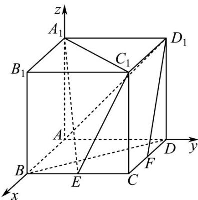

> [!faq]- 《专题21 立体几何大题综合》真题解析
>
> > [!success]- **【答案】** 详见解析
>
> > [!note]- **【分析】**
> > （Ⅰ）建立空间直角坐标系，求出 $D_{1}F$ 及平面 $A_{1}EC_{1}$ 的一个法向量m，证明 $D_{1}F\perp m$ ，即可得证；(Ⅱ)求出 $AC_{1}$ ，由 $\sin\theta=\left|\cos\left\langle m,AC_{1}\right\rangle\right|$ 运算即可得解；
> >
> > (Ⅲ) 求得平面 $AA_{1}C_{1}$ 的一个法向量 $\frac{u}{DB}$ ，由 $\cos\left\langle\overrightarrow{DB},m\right\rangle=\frac{\overrightarrow{DB}\cdot m}{\left|\overrightarrow{DB}\right|\cdot\left|m\right|}$ 结合同角三角函数的平方关系即可得解.
>
> > [!note]- **【解析】**
> > （1）以A为原点， $AB,AD,AA_{1}$ 分别为 $x,y,z$ 轴，建立如图空间直角坐标系，
> > 则 $A(0,0,0), A_1(0,0,2), B(2,0,0), C(2,2,0), D(0,2,0), C_1(2,2,2), D_1(0,2,2)$
> > 因为 E 为棱 BC 的中点，F 为棱 CD 的中点，所以 $E(2,1,0)$ ， $F(1,2,0)$ ，
> > 所以 $D_{1}F = (1,0,-2)$ , $A_{1}C_{1} = (2,2,0)$ , $A_{1}E = (2,1,-2)$ ,
> > 设平面 $A_{1}EC_{1}$ 的一个法向量为 $\stackrel{\square}{m} = (x_1,y_1,z_1)$
> > 则 $\left\{ \begin{array}{l} m \cdot A_{1}C_{1} = 2x_{1} + 2y_{1} = 0 \\ m \cdot A_{1}E = 2x_{1} + y_{1} - 2z_{1} = 0 \end{array} \right.$ ，令 $x_{1} = 2$ ，则 $m = (2, - 2, 1)$
> > 因为 $D_{1}F \cdot m = 2 - 2 = 0$ ，所以 $D_{1}F \perp m$ ，
> > 因为 $D_{1}F \not\subset$ 平面 $A_{1}EC_{1}$ ，所以 $D_{1}F //$ 平面 $A_{1}EC_{1}$ ；
> > (Ⅱ)由(1)得， $AC_{1}=\left(2,2,2\right)$
> > 设直线 $AC_{1}$ 与平面 $A_{1}EC_{1}$ 所成角为 $\theta$ ，
> > 则 $\sin\theta=\left|\cos\left\langle\vec{m},AC_{1}\right\rangle\right|=\left|\frac{\vec{m}\cdot AC_{1}}{\left|\vec{m}\right|\cdot\left|AC_{1}\right|}\right|=\frac{2}{3\times2\sqrt{3}}=\frac{\sqrt{3}}{9}$ ;
> > （Ⅲ）由正方体的特征可得，平面 $AA_{1}C_{1}$ 的一个法向量为 $\overline{DB}=(2,-2,0)$
> > 则 $\cos \left\langle \overrightarrow{DB}, m \right\rangle = \frac{\overrightarrow{DB} \cdot m}{\left|\overrightarrow{DB}\right| \cdot \left|m\right|} = \frac{8}{3 \times 2\sqrt{2}} = \frac{2\sqrt{2}}{3}$
> > 所以二面角 $A-A_{1}C_{1}-E$ 的正弦值为 $\sqrt{1-\cos^{2}\left\langle DB,m\right\rangle}=\frac{1}{3}$ .
> > 
