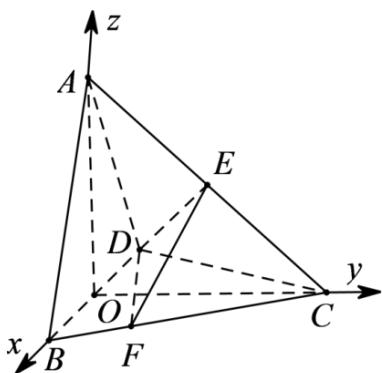

> [!faq]- 《专题21 立体几何大题综合》真题解析
>
> > [!success]- **【答案】** 详见解析
>
> > [!note]- **【分析】**
> > （1）建立空间直角坐标系，利用向量数量积求直线向量夹角，即得结果；
> >
> > (2) 先求两个平面法向量，根据向量数量积求法向量夹角，最后根据二面角与向量夹角关系得结果·
>
> > [!note]- **【解析】**
> > 
> > (1) 连 CO Q BC = CD, BO = OD ∴ CO ⊥ BD
> > 以 OB, OC, OA 为 x, y, z 轴建立空间直角坐标系，则 $A(0,0,2)$ , $B(1,0,0)$ , $C(0,2,0)$ , $D(-1,0,0)$ ∴ $E(0,1,1)$
> > $$
> > \therefore A B = (1, 0, - 2), D E = (1, 1, 1) \therefore \cos <   A B, D E > = \frac {- 1}{\sqrt {5} \sqrt {3}} = - \frac {\sqrt {1 5}}{1 5}
> > $$
> > 从而直线 $AB$ 与 $DE$ 所成角的余弦值为 $\frac{\sqrt{15}}{15}$
> > (2) 设平面 DEC 一个法向量为 $n_{1} = (x, y, z)$ ,
> > $$
> > \because \stackrel {\square \square \square} {D C} = (1, 2, 0), \left\{ \begin{array}{l} \stackrel {\sqcup} {n _ {1}} \cdot \stackrel {\square \square \square} {D C} = 0 \\ \stackrel {\square \square \square} {n _ {1}} \cdot D E = 0 \end{array} \therefore \left\{ \begin{array}{l} x + 2 y = 0 \\ x + y + z = 0 \end{array} \right. \right.
> > $$
> > 令 $y = 1\therefore x = -2,z = 1\therefore n_{1} = (-2,1,1)$
> > 设平面 DEF 一个法向量为 $n_{2}^{u u} = (x_{1}, y_{1}, z_{1})$ ,
> > $$
> > \because \frac {\square \square \square}{D F} = \frac {\square \square \square}{D B} + \frac {\square \square \square}{B F} = \frac {\square \square \square}{D B} + \frac {1}{4} \frac {\square \square \square}{B C} = (\frac {7}{4}, \frac {1}{2}, 0), \left\{ \begin{array}{l l} n _ {2} \cdot D F = 0 \\ n _ {2} \cdot D E = 0 \end{array} \right. \therefore \left\{ \begin{array}{l l} \frac {7}{4} x _ {1} + \frac {1}{2} y _ {1} = 0 \\ x _ {1} + y _ {1} + z _ {1} = 0 \end{array} \right.
> > $$
> > 令 $y_{1} = -7\therefore x_{1} = 2,z_{1} = 5\therefore n_{2} = (2, - 7,5)$
> > $$
> > \therefore \cos <   n _ {1}, n _ {2} > = \frac {- 6}{\sqrt {6} \sqrt {7 8}} = - \frac {1}{\sqrt {1 3}}
> > $$
> > 因此 $\sin\theta=\frac{\sqrt{12}}{\sqrt{13}}=\frac{2\sqrt{39}}{13}$
> > 【点睛】本题考查利用向量求线线角与二面角，考查基本分析求解能力，属中档题·
