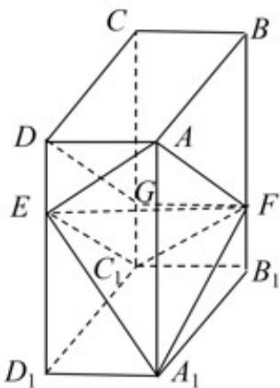
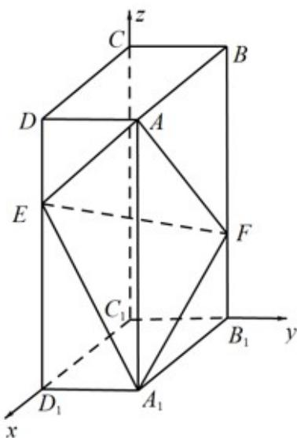
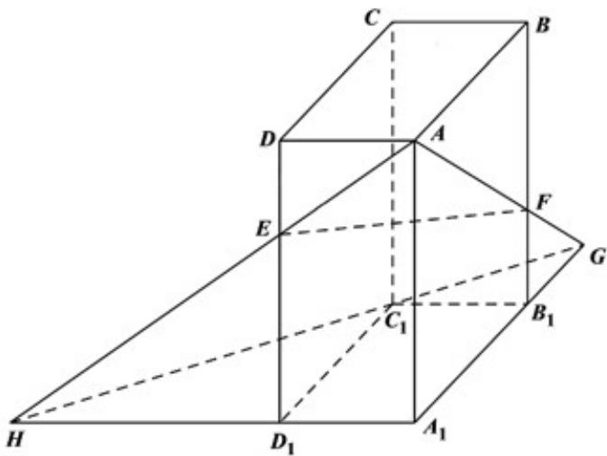
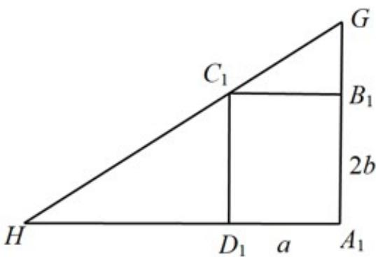
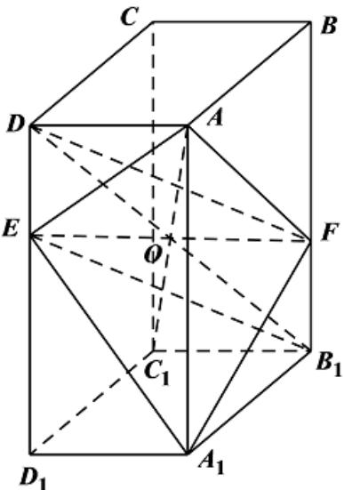
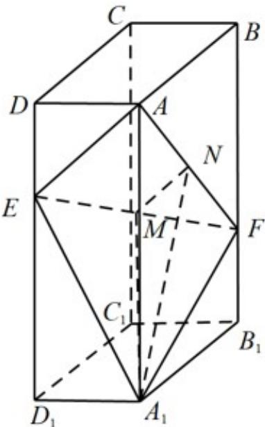
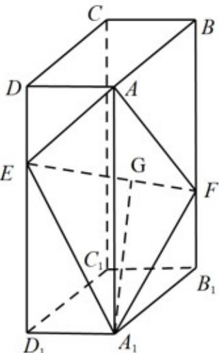

> [!faq]- 《专题21 立体几何大题综合》真题解析
>
> > [!success]- **【答案】** 详见解析
>
> > [!note]- **【分析】**
> > 【分析】（1）方法一：连接 $C_1E$ 、 $C_1F$ ，证明出四边形 $AEC_{1}F$ 为平行四边形，进而可证得点 $C_1$ 在平面 $AEF$ 内；
> >
> > (2) 方法一：以点 $C_1$ 为坐标原点， $C_1D_1$ 、 $C_1B_1$ 、 $C_1C$ 所在直线分别为 $x$ 、 $y$ 、 $z$ 轴建立空间直角坐标系 $C_1 - xyz$ ，利用空间向量法可计算出二面角 $A - EF - A_1$ 的余弦值，进而可求得二面角 $A - EF - A_1$ 的正弦值。【详解】（1）[方法一]【最优解】：利用平面基本事实的推论
> >
> > 在棱 $CC_{1}$ 上取点G，使得 $C_{1}G=\frac{1}{2}CG$ ，连接DG、FG、 $C_{1}E$ 、 $C_{1}F$ ，如图 $^{1}$ 所示。
> >
> > 
> > 图1
> >
> > 在长方体 $ABCD - A_1B_1C_1D_1$ 中， $BF // CG, BF = CG$ ，所以四边形 $BCGF$ 为平行四边形，则 $BC // FG, BC = FG$ ，而 $BC = AD, BC // AD$ ，所以 $AD // FG, AD = FG$ ，所以四边形 $DAFG$ 为平行四边形，即有 $AF // DG$ ，同理可证四边形 $DEC_{1}G$ 为平行四边形， $\therefore C_{1}E // DG$ ， $\therefore C_{1}E // AF$ ，因此点 $C_{1}$ 在平面 $AEF$ 内·
> >
> > [方法二]：空间向量共线定理
> >
> > 
> > 图2
> >
> > 以 $C_1D_1, C_1B_1, C_1C$ 分别为 $x$ 轴， $y$ 轴， $z$ 轴，建立空间直角坐标系，如图2所示.
> >
> > 设 $C_1D_1 = a, C_1B_1 = b, C_1C = 3c$ ，则 $C_1(0,0,0), E(a,0,2c), F(0,b,c), A(a,b,3c)$
> >
> > 所以 $C_{1}E=(a,0,2c),FA=(a,0,2c)$ 。故 $C_{1}E=FA$ 。所以 $AF\parallel C_{1}E$ ，点 $C_{1}$ 在平面 AEF 内。
> >
> > ## [方法三]：平面向量基本定理
> >
> > 同方法二建系，并得 $C_1(0,0,0), E(a,0,2c), F(0,b,c), A(a,b,3c)$
> >
> > 所以 $C_1E = (a,0,2c), C_1F = (0,b,c), C_1A = (a,b,3c)$
> >
> > 故 $C_1A = C_1E + C_1F$ .所以点 $C_1$ 在平面 $AEF$ 内.
> >
> > [方法四]：
> >
> > 根据题意，如图3，设 $A_{1}D_{1} = a, A_{1}B_{1} = 2b, A_{1}A = 3c$
> >
> > 在平面 $A_{1}B_{1}BA$ 内，因为 $BF = 2FB_{1}$ ，所以 $B_{1}F = \frac{1}{3} B_{1}B = \frac{1}{3} A_{1}A$
> >
> > 
> > 图3
> >
> > 延长 AF 交 $A_{1}B_{1}$ 于 G，
> >
> > $AF\subset$ 平面 $AEF$
> >
> > $A_{1}B_{1}\subset$ 平面 $A_{1}B_{1}C_{1}D_{1}$
> >
> > $$
> > G \in A F, G \in A _ {1} B _ {1}
> > $$
> >
> > 所以 $G \in$ 平面 AEF, $G \in$ 平面 $A_{1}B_{1}C_{1}D_{1}$ ①.
> >
> > 延长 AE 交 $A_{1}D_{1}$ 于 H，同理 $H \in$ 平面 AEF, $H \in$ 平面 $A_{1}B_{1}C_{1}D_{1}$ ②
> >
> > 由①②得，平面 $AEF \cap$ 平面 $A_{1}B_{1}C_{1}D_{1} = GH$
> >
> > 连接 $GH, GC_{1}, HC_{1}$ ，根据相似三角形知识可得 $GB_{1} = b, D_{1}H = 2a$
> >
> > 在 $Rt\Delta C_1B_1G$ 中， $C_1G = \sqrt{a^2 + b^2}$
> >
> > 同理，在 $Rt\triangle C_1D_1H$ 中， $C_1H = 2\sqrt{a^2 + b^2}$
> >
> > 
> > 图4
> >
> > 如图4，在 $Rt\triangle A_{1}GH$ 中， $GH = 3\sqrt{a^{2} + b^{2}}$
> >
> > 所以 $GH = C_{1}G + C_{1}H$ ，即 G， $C_{1}$ ，H 三点共线。
> >
> > 因为 $GH$ 平面 AEF ，所以 $C_{1} \subset$ 平面 AEF ，得证 .
> >
> > [方法五]：
> >
> > 如图5，连接 $DF, EB_1, DB_1$ ，则四边形 $DEB_1F$ 为平行四边形，设 $DB_1$ 与 $EF$ 相交于点 $O$ ，则 $O$ 为 $EF, DB_1$ 的中点．联结 $AC_1$ ，由长方体知识知，体对角线交于一点，且为它们的中点，即 $AC_1 \cap B_1D = O$ ，则 $AC_1$ 经过点 $O$ ，故点 $C_1$ 在平面 $AEF$ 内．
> >
> > 
> > 图5
> >
> > (2) [方法一] 【最优解】：坐标法
> >
> > 以点 $C_1$ 为坐标原点， $C_1D_1$ 、 $C_1B_1$ 、 $C_1C$ 所在直线分别为 $x$ 、 $y$ 、 $z$ 轴建立如下图所示的空间直角坐标系
> >
> > $C_{1}-xyz$ ，如图2.
> >
> > 则 $A(2,1,3)$ 、 $A_{1}(2,1,0)$ 、 $E(2,0,2)$ 、 $F(0,1,1)$
> >
> > $$
> > \stackrel {{\mathrm{uu}}} {{A E}} = (0, - 1, - 1), \stackrel {{\mathrm{uu}}} {{A F}} = (- 2, 0, - 2), \stackrel {{\mathrm{uu}}} {{A _ {1} E}} = (0, - 1, 2), \stackrel {{\mathrm{uu}}} {{A _ {1} F}} = (- 2, 0, 1)
> > $$
> >
> > 设平面 $AEF$ 的一个法向量为 $\stackrel{\square}{m} = (x_1, y_1, z_1)$
> >
> > 由 $\left\{ \begin{array}{l}m\cdot \overline{\square}\overline{\square} = 0\\ m\cdot AF = 0 \end{array} \right.$ ，得 $\left\{ \begin{array}{ll} - y_1 - z_1 = 0\\ -2x_1 - 2z_1 = 0 \end{array} \right.$ 取 $z_{1} = -1$ ，得 $x_{1} = y_{1} = 1$ ，则 $\overline{\square} m = (1,1, - 1)$
> >
> > 设平面 $A_{1}EF$ 的一个法向量为 $n=(x_{2},y_{2},z_{2})$
> >
> > 由 $\left\{ \begin{array}{l} n \cdot A_{1}E = 0 \\ n \cdot A_{1}F = 0 \end{array} \right.$ ，得 $\left\{ \begin{array}{l} -y_{2} + 2z_{2} = 0 \\ -2x_{2} + z_{2} = 0 \end{array} \right.$ ，取 $z_{2} = 2$ ，得 $x_{2} = 1$ ， $y_{2} = 4$ ，则 $n = (1,4,2)$ ，
> >
> > $$
> > \cos <   m, n > = \frac {\square m \cdot n}{| m | \cdot | n |} = \frac {3}{\sqrt {3} \times \sqrt {2 1}} = \frac {\sqrt {7}}{7}
> > $$
> >
> > 设二面角 $A - EF - A_{1}$ 的平面角为 $\theta$ ，则 $\left|\cos \theta \right| = \frac{\sqrt{7}}{7}$ ， $\therefore \sin \theta = \sqrt{1 - \cos^2 \theta} = \frac{\sqrt{42}}{7}$ 因此，二面角 $A - EF - A_{1}$ 的正弦值为 $\frac{\sqrt{42}}{7}$
> >
> > [方法二]：定义法
> >
> > 
> > 图6
> >
> > 在 $\triangle AEF$ 中， $AE = \sqrt{2}, AF = 2\sqrt{2}, EF = \sqrt{5 + 1} = \sqrt{6}$ ，即 $AE^2 + EF^2 = AF^2$ ，所以 $AE \perp EF$ 。在 $\triangle A_1EF$ 中， $A_1E = A_1F = \sqrt{5}$ ，如图6，设 $EF, AF$ 的中点分别为 $M, N$ ，连接 $A_1M, MN, A_1N$ ，则 $A_1M \perp EF, MN \perp EF$ ，所以 $\angle A_1MN$ 为二面角 $A - EF - A_1$ 的平面角。
> >
> > 在 $\triangle A_{1}MN$ 中， $MN = \frac{\sqrt{2}}{2}, A_{1}M = \sqrt{A_{1}F^{2} - MF^{2}} = \frac{\sqrt{14}}{2}, A_{1}N = \sqrt{5}$
> >
> > 所以 $\cos\angle A_{1}MN=\frac{\frac{1}{2}+\frac{7}{2}-5}{2\times\frac{\sqrt{2}}{2}\times\frac{\sqrt{14}}{2}}=-\frac{\sqrt{7}}{7}$ ，则 $\sin\angle A_{1}MN=\sqrt{1-\frac{1}{7}}=\frac{\sqrt{42}}{7}$
> >
> > [方法三]：向量法
> >
> > 
> > 图7
> >
> > 由题意得 $AE = \sqrt{2}$ , $AF = \sqrt{8}$ , $A_{1}F = A_{1}E = \sqrt{5}$ , $EF = \sqrt{6}$
> >
> > 由于 $AE^{2} + EF^{2} = AF^{2}$ ，所以 $AE \perp EF$ 。
> >
> > 如图7，在平面 $A_{1}EF$ 内作 $A_{1}G \perp EF$ ，垂足为 $G$ ，
> >
> > 则 $EA$ 与 $GA_{1}$ 的夹角即为二面角 $A - EF - A_{1}$ 的大小.
> >
> > 由 $AA_{1}=\overline{AE}+\overline{EG}+\overline{GA}_{1}$ ，得 $AA_{1}^{2}=AE^{2}+EG^{2}+GA_{1}^{2}+2AE\cdot EG+2EG\cdot GA_{1}+2AE\cdot GA_{1}$
> >
> > 其中， $EG=\frac{\sqrt{6}}{2},A_{1}G=\frac{\sqrt{14}}{2}$ ，解得 $AE\cdot GA_{1}=1$ ， $\cos\langle AE,GA_{1}\rangle=\frac{1}{\sqrt{7}}$
> >
> > 所以二面角 $A - EF - A_{1}$ 的正弦值 $\frac{\sqrt{42}}{7}$
> >
> > [方法四]：三面角公式
> >
> > 由题易得， $EA = \sqrt{2}, FA = 2\sqrt{2}, FE = \sqrt{6}, EA_{1} = \sqrt{5}, FA_{1} = \sqrt{5}$
> >
> > 所以 $\cos\angle AEA_{1}=\frac{EA^{2}+EA_{1}^{2}-AA_{1}^{2}}{2EA\cdot EA_{1}}=\frac{(\sqrt{2})^{2}+(\sqrt{5})^{2}-3^{2}}{2\sqrt{2}\cdot\sqrt{5}}=\frac{-\sqrt{10}}{10}$
> >
> > $$
> > \cos \angle A E F = \frac {E A ^ {2} + E F ^ {2} - A F ^ {2}}{2 E A \cdot E F} = \frac {(\sqrt {2}) ^ {2} + (\sqrt {6}) ^ {2} - (2 \sqrt {2}) ^ {2}}{2 \sqrt {2} \cdot \sqrt {6}} = 0, \sin \angle A E F = 1
> > $$
> >
> > $$
> > \cos \angle A _ {1} E F = \frac {E A _ {1} ^ {2} + E F ^ {2} - A _ {1} F ^ {2}}{2 E A _ {1} \cdot E F} = \frac {(\sqrt {5}) ^ {2} + (\sqrt {6}) ^ {2} - (\sqrt {5}) ^ {2}}{2 \sqrt {5} \cdot \sqrt {6}} = \frac {\sqrt {3 0}}{1 0}, \sin \angle A _ {1} E F = \frac {\sqrt {7 0}}{1 0}.
> > $$
> >
> > 设 $\theta$ 为二面角 $A - EF - A_{1}$ 的平面角，由二面角的三个面角公式，得
> >
> > $\cos \theta = \frac{\cos\angle AEA_1 - \cos\angle AEF\cdot\cos\angle A_1EF}{\sin\angle AEF\cdot\sin\angle A_1EF} = \frac{-\sqrt{10}}{\sqrt{70}} = \frac{-\sqrt{7}}{7}$ ，所以 $\sin \theta = \frac{\sqrt{42}}{7}$
> >
> > 【整体点评】（1）方法一：通过证明直线 $C_1E // AF$ ，根据平面的基本事实二的推论即可证出，思路直接，简单明了，是通性通法，也是最优解；方法二：利用空间向量基本定理证明；方法三：利用平面向量基本定理；方法四：利用平面的基本事实三通过证明三点共线说明点在平面内；方法五：利用平面的基本事实以及平行四边形的对角线和长方体的体对角线互相平分即可证出。
> >
> > (2) 方法一：利用建立空间直角坐标系，由两个平面的法向量的夹角和二面角的关系求出；方法二：利用二面角的定义结合解三角形求出；方法三：利用和二面角公共棱垂直的两个向量夹角和二面角的关系即可求出，为最优解；方法四：利用三面角的余弦公式即可求出。
>
> > [!note]- **【解析】**
> > 本题未单列解析。
