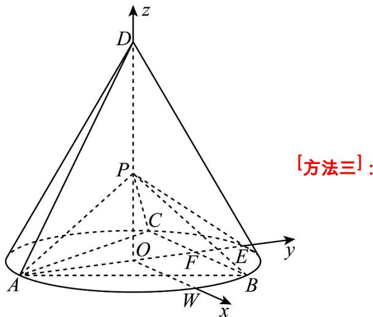
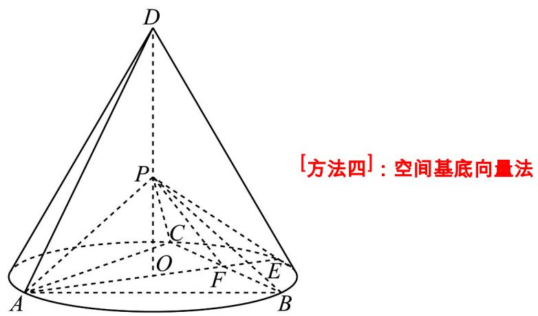
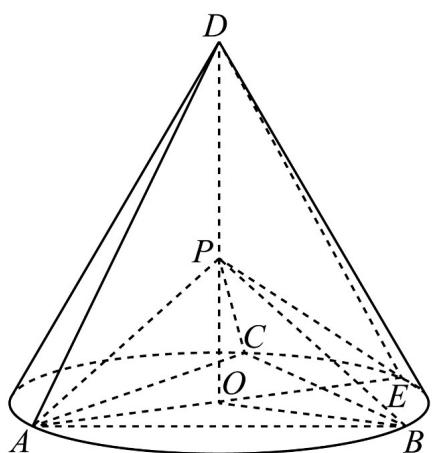
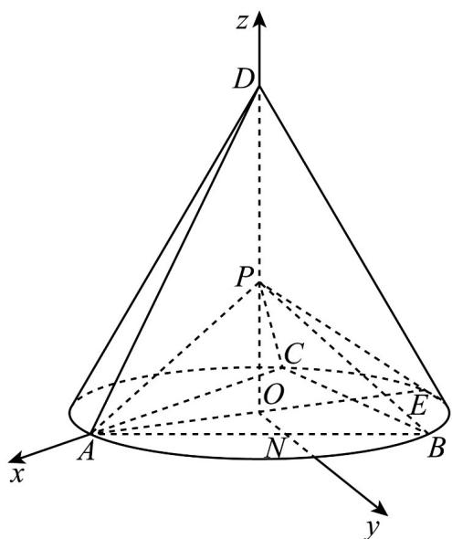
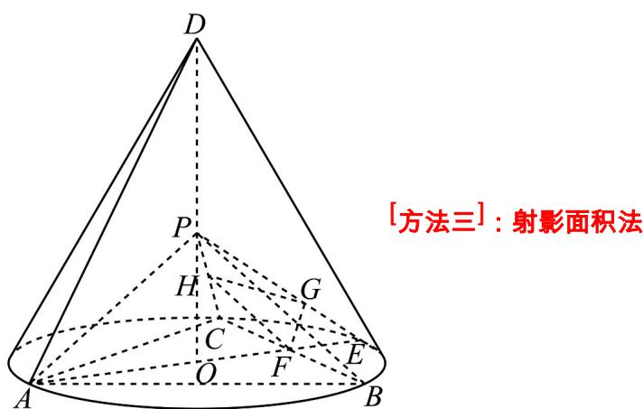
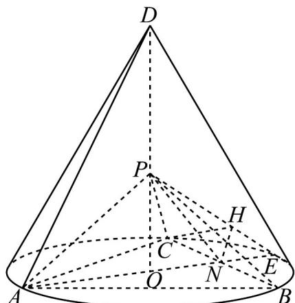

> [!faq]- 《专题21 立体几何大题综合》真题解析
>
> > [!success]- **【答案】** 详见解析
>
> > [!note]- **【分析】**
> > 【分析】（1）要证明 $PA \perp$ 平面 PBC，只需证明 $PA \perp PB$ ， $PA \perp PC$ 即可；
> >
> > (2) 方法一：过 $O$ 作 $ON \parallel BC$ 交 $AB$ 于点 $N$ ，以 $O$ 为坐标原点， $OA$ 为 $x$ 轴， $ON$ 为 $y$ 轴建立如图所示的空间直角坐标系，分别算出平面 $PCB$ 的一个法向量 $n$ ，平面 $PCE$ 的一个法向量为 $m$ ，利用公式
> >
> > $\cos < m, n > = \frac{n \cdot m}{|n||m|}$ 计算即可得到答案.
>
> > [!note]- **【解析】**
> > 【详解】（1）[方法一]：勾股运算法证明
> > 由题设，知 $\triangle DAE$ 为等边三角形，设 $AE = 1$ ，
> > 则 $DO = \frac{\sqrt{3}}{2}$ ， $CO = BO = \frac{1}{2} AE = \frac{1}{2}$ ，所以 $PO = \frac{\sqrt{6}}{6} DO = \frac{\sqrt{2}}{4}$
> > $$
> > P C = \sqrt {P O ^ {2} + O C ^ {2}} = \frac {\sqrt {6}}{4} = P B = P A
> > $$
> > 又 $\triangle ABC$ 为等边三角形，则 $\frac{BA}{\sin 60^\circ} = 2OA$ ，所以 $BA = \frac{\sqrt{3}}{2}$
> > $PA^{2}+PB^{2}=\frac{3}{4}=AB^{2}$ ，则 $\angle APB=90^{\circ}$ ，所以 $PA\perp PB$ ，
> > 同理 $PA \perp PC$ ，又 $PC \cap PB = P$ ，所以 $PA \perp$ 平面PBC；
> > [方法二]：空间直角坐标系法
> > 不妨设 $AB = 2\sqrt{3}$ ，则 $AE = AD = \frac{AB}{\sin 60^\circ} = 4$ ，由圆锥性质知 $DO \perp$ 平面 $ABC$ ，所以
> > $DO = \sqrt{AD^{2} - AO^{2}} = \sqrt{4^{2} - 2^{2}} = 2\sqrt{3}$ ，所以 $PO = \frac{\sqrt{6}}{6}DO = \sqrt{2}$ 。因为O是 $\triangle ABC$ 的外心，因此 $AE \perp BC$ 。
> > 在底面过 O 作 BC 的平行线与 AB 的交点为 W，以 O 为原点， $\overline{OW}$ 方向为 x 轴正方向， $\overline{OE}$ 方向为 y 轴正方向， $\overline{OD}$ 方向为 z 轴正方向，建立空间直角坐标系 O-xyz，
> > 则 $A(0, -2, 0)$ ， $B(\sqrt{3}, 1, 0)$ ， $C(-\sqrt{3}, 1, 0)$ ， $E(0, 2, 0)$ ， $P(0, 0, \sqrt{2})$
> > 所以 $\stackrel{\square\square}{AP}=(0,2,\sqrt{2})$ ， $\stackrel{\square\square\square}{BP}=(-\sqrt{3},-1,\sqrt{2})$ ， $\stackrel{\square\square\square}{CP}=(\sqrt{3},-1,\sqrt{2})$ 。
> > 故 $AP \cdot BP = 0 - 2 + 2 = 0$ ， $AP \cdot CP = 0 - 2 + 2 = 0$
> > 所以 $AP \perp BP$ ， $AP \perp CP$
> > 又 $BP \cap CP = P$ ，故 $AP \perp$ 平面 $PBC$
> > 
> > 因为 $\triangle ABC$ 是底面圆 $O$ 的内接正三角形，且 $AE$ 为底面直径，所以 $AE \perp BC$
> > 因为 $DO$ （即 $PO$ ）垂直于底面， $BC$ 在底面内，所以 $PO \perp BC$
> > 又因为 $PO \subset$ 平面 $PAE$ ， $AE \subset$ 平面 $PAE$ ， $POI AE = O$ ，所以 $BC \perp$ 平面 $PAE$
> > 又因为 $PA \subset$ 平面 $PAE$ ，所以 $PA \perp BC$
> > 设 $AE \cap BC = F$ ，则 $F$ 为 $BC$ 的中点，连结 $PF$
> > 设 $DO = a$ ，且 $PO = \frac{\sqrt{6}}{6} DO$
> > 则 $AF = \frac{\sqrt{3}}{2} a$ ， $PA = \frac{\sqrt{2}}{2} a$ ， $PF = \frac{1}{2} a$
> > 因此 $PA^2 + PF^2 = AF^2$ ，从而 $PA \perp PF$
> > 又因为 $PF \cap BC = F$ ，所以 $PA \perp$ 平面 $PBC$ 。
> > 
> > 如图所示，圆锥底面圆 $O$ 半径为 $R$ ，连结 $DE$ ， $AE = AD = DE$ ，易得 $OD = \sqrt{3} R$
> > 
> > 因为 $PO = \frac{\sqrt{6}}{6} OD$ ，所以 $PO = \frac{\sqrt{2}}{2} R$
> > 以 $OA, OB, OD$ 为基底， $OD \perp$ 平面 $ABC$ ，则 $AP = AO + OP = -OA + \frac{\sqrt{6}}{6}OD$
> > $\overrightarrow{BP}=\overrightarrow{BO}+\overrightarrow{OP}=-\overrightarrow{OB}+\frac{\sqrt{6}}{6}\overrightarrow{OD}$ ，且 $OA\cdot OB=-\frac{1}{2}R^{2}$ ， $OA\cdot OD=OB\cdot OD=0$
> > $$
> > \begin{array}{l} \square \square \square \\ A P \cdot B P = \left(- O A + \frac {\sqrt {6}}{6} O D\right) \cdot \left(- O B + \frac {\sqrt {6}}{6} O D\right) = \square \square \square \\ O A \cdot O B - O A \cdot \frac {\sqrt {6}}{6} O D - O B \cdot \frac {\sqrt {6}}{6} O D + \frac {1}{6} O D ^ {2} = 0 \end{array}
> > $$
> > 故 $AP \cdot BP = 0$ 。所以 $AP \perp BP$ ，即 $AP \perp BP$
> > 同理 $AP \perp CP$ 。又 $BP \cap CP = P$ ，所以 $AP \perp$ 平面 $PBC$ 。
> > (2) [方法一]：空间直角坐标系法
> > 过 O 作 ON $\parallel BC$ 交 AB 于点 N，因为 PO $\perp$ 平面 ABC，以 O 为坐标原点，OA 为 x 轴，ON 为 y 轴建立如图所示的空间直角坐标系，
> > 
> > 则 $E(-\frac{1}{2},0,0),P(0,0,\frac{\sqrt{2}}{4}),B(-\frac{1}{4},\frac{\sqrt{3}}{4},0),C(-\frac{1}{4}, - \frac{\sqrt{3}}{4},0)$
> > $\overrightarrow{PC} = (-\frac{1}{4}, -\frac{\sqrt{3}}{4}, -\frac{\sqrt{2}}{4})$ , $\overrightarrow{PB} = (-\frac{1}{4}, \frac{\sqrt{3}}{4}, -\frac{\sqrt{2}}{4})$ , $\overrightarrow{PE} = (-\frac{1}{2}, 0, -\frac{\sqrt{2}}{4})$ ,
> > 设平面 $PCB$ 的一个法向量为 $n = (x_{1},y_{1},z_{1})$
> > 由 $\left\{ \begin{array}{l} n \cdot \overline{PC} = 0 \\ n \cdot PB = 0 \end{array} \right.$ ，得 $\left\{ \begin{array}{l} -x_1 - \sqrt{3} y_1 - \sqrt{2} z_1 = 0 \\ -x_1 + \sqrt{3} y_1 - \sqrt{2} z_1 = 0 \end{array} \right.$ ，令 $x_1 = \sqrt{2}$ ，得 $z_1 = -1, y_1 = 0$ ，
> > 所以 $n = (\sqrt{2}, 0, -1)$
> > 设平面 $PCE$ 的一个法向量为 $\stackrel{\square}{m} = (x_{2},y_{2},z_{2})$
> > 由 $\left\{ \begin{array}{l} m \cdot \overline{PC} = 0 \\ m \cdot PE = 0 \end{array} \right.$ ，得 $\left\{ \begin{array}{c} -x_2 - \sqrt{3}y_2 - \sqrt{2}z_2 = 0 \\ -2x_2 - \sqrt{2}z_2 = 0 \end{array} \right.$ ，令 $x_2 = 1$ ，得 $z_2 = -\sqrt{2}, y_2 = \frac{\sqrt{3}}{3}$ ，
> > 所以 $\vec{m}=(1,\frac{\sqrt{3}}{3},-\sqrt{2})$
> > 故 $\cos < m, n > = \frac{n \cdot m}{|n| \cdot |m|} = \frac{2\sqrt{2}}{\sqrt{3} \times \frac{\sqrt{10}}{\sqrt{3}}} = \frac{2\sqrt{5}}{5}$
> > 设二面角 B-PC-E 的大小为 $\theta$ ，由图可知二面角为锐二面角，所以 $\cos\theta=\frac{2\sqrt{5}}{5}$ .
> > [方法二]【最优解】：几何法
> > 设 $BC \cap AE = F$ ，易知 $F$ 是 $BC$ 的中点，过 $F$ 作 $FG \parallel AP$ 交 $PE$ 于 $G$ ，取 $PC$ 的中点 $H$ ，
> > 联结 GH ，则 HF ∥ PB .
> > 由 $PA \perp$ 平面 PBC ，得 $FG \perp$ 平面 PBC .
> > 由（1）可得， $BC^{2} = PB^{2} + PC^{2}$ ，得 $PB\bot PC$
> > 所以 $FH \perp PC$ ，根据三垂线定理，得 $GH \perp PC$ 。
> > 所以 $\angle GHF$ 是二面角 $B - PC - E$ 的平面角.
> > 设圆 $O$ 的半径为 $r$ ，则 $AF = AB\sin 60^{\circ} = \frac{3}{2} r$ ， $AE = 2r$ ， $EF = \frac{1}{2} r$ ， $\frac{EF}{AF} = \frac{1}{3}$ ，所以 $FG = \frac{1}{4} PA$
> > $$
> > F H = \frac {1}{2} P B = \frac {1}{2} P A, \frac {F G}{F H} = \frac {1}{2}
> > $$
> > 在 $Rt\triangle GFH$ 中， $\tan \angle GHF = \frac{FG}{FH} = \frac{1}{2}$
> > $$
> > \cos \angle G H F = \frac {2 \sqrt {5}}{5}
> > $$
> > 所以二面角 $B - PC - E$ 的余弦值为 $\frac{2\sqrt{5}}{5}$
> > 
> > [方法三]：射影面积法
> > 如图所示，在 $PE$ 上取点 $H$ ，使 $HE = \frac{1}{4} PE$ ，设 $BC\cap AE = N$ ，连结 $NH$ ：
> > 由（1）知 $NE = \frac{1}{4} AE$ ，所以 $NH \parallel PA$ 。故 $NH \perp$ 平面 PBC。
> > 所以，点 H 在面 PBC 上的射影为 N .
> > 故由射影面积法可知二面角 $B - PC - E$ 的余弦值为 $\cos \theta = \frac{S_{\triangle PCN}}{S_{\triangle PCH}}$
> > 在 $\triangle PCE$ 中，令 $PC = PE = \frac{\sqrt{6}}{2}$ ，则 $CE = 1$ ，易知 $S_{\triangle PCE} = \frac{\sqrt{5}}{4}$ 。所以 $S_{\triangle PCH} = \frac{3}{4} S_{\triangle PCE} = \frac{3\sqrt{5}}{16}$
> > 又 $S_{\triangle PCN} = \frac{1}{2} S_{\triangle PBC} = \frac{3}{8}$ ，故 $\cos \theta = \frac{S_{\triangle PCN}}{S_{\triangle PCH}} = \frac{\frac{3}{8}}{\frac{3\sqrt{5}}{16}} = \frac{2\sqrt{5}}{5}$
> > 所以二面角 $B - PC - E$ 的余弦值为 $\frac{2\sqrt{5}}{5}$
> > 
> > 【整体点评】本题以圆锥为载体，隐含条件是圆锥的轴垂直于底面，（1）方法一：利用勾股数进行运算证明，是在给出数据去证明垂直时的常用方法；方法二：选择建系利用空间向量法，给空间立体感较弱的学生提供了可行的途径；方法三：利用线面垂直，结合勾股定理可证出；方法四：利用空间基底解决问题此解法在解答题中用的比较少；
> > (2) 方法一：建系利用空间向量法求解二面角，属于解答题中求角的常规方法；方法二：利用几何法，通过三垂线法作出二面角，求解三角形进行求解二面角，适合立体感强的学生；方法三：利用射影面积法求解二面角，提高解题速度。
