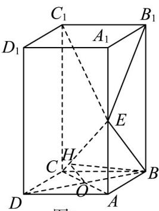
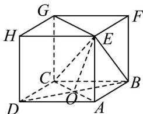
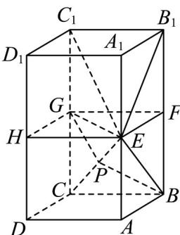
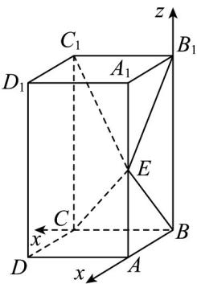

> [!faq]- 《专题21 立体几何大题综合》真题解析
>
> > [!success]- **【答案】** 详见解析
>
> > [!note]- **【分析】**
> > （1）利用长方体的性质，可以知道 $B_{1}C_{1} \perp$ 侧面 $A_{1}B_{1}BA$ ，利用线面垂直的性质可以证明出 $B_{1}C_{1}\perp EB$ ，这样可以利用线面垂直的判定定理，证明出 $BE\perp$ 平面 $EB_{1}C_{1}$ ；
> >
> > (2) 以点 $B$ 坐标原点，以 $\overline{BC}, \overline{BA}, \overline{BB}_1$ 分别为 $x, y, z$ 轴，建立空间直角坐标系，设正方形 $ABCD$ 的边长为 $a$ ， $B_1B = b$ ，求出相应点的坐标，利用 $BE \perp EC_1$ ，可以求出 $a, b$ 之间的关系，分别求出平面 $EBC$ 、平面 $ECC_1$ 的法向量，利用空间向量的数量积公式求出二面角 $B - EC - C_1$ 的余弦值的绝对值，最后利用同角的三角函数关系，求出二面角 $B - EC - C_1$ 的正弦值。
>
> > [!note]- **【解析】**
> > （1）证明：因为 $ABCD - A_{1}B_{1}C_{1}D_{1}$ 是长方体，所以 $B_{1}C_{1} \perp$ 侧面 $A_{1}B_{1}BA$ ，而 $BE \subset$ 平面 $A_{1}B_{1}BA$ ，所以 $BE \perp B_{1}C_{1}$
> > 又 $BE \perp EC_{1}$ ， $B_{1}C_{1} \cap EC_{1} = C_{1}$ ， $B_{1}C_{1}, EC_{1} \subset$ 平面 $EB_{1}C_{1}$ ，因此 $BE \perp$ 平面 $EB_{1}C_{1}$ ；
> > ## [方法一]【三垂线定理】
> > 由（1）知， $BE \perp EB_{1}$ ，又E为 $AA_{1}$ 的中点，所以 $\triangle BEB_{1}$ ，为等腰直角三角形，所以 $AA_{1} = 2AB$
> > 如图 $^{2}$ ，联结 AC，与 BD 相交于点 O，因为 $AA_{1} \perp$ 平面 ABCD，所以 $AA_{1} \perp BO$
> > 又 $BO \perp AC$ ，所以 $BO \perp$ 平面 $ACC_{1}A_{1}$
> > 作 $OH \perp CE$ ，垂足为 $H$ ，联结 $BH$ ，由三垂线定理可知 $BH \perp CE$ ，则 $\angle OHB$ 为二面角 $B - EC - C_1$ 平面角的补角．
> > <!-- source-part:3 pages:401-471 -->
> > 图2
> > 
> > 设 $AB = 1$ ，则 $AA_{1} = 2, AE = 1, AC = \sqrt{2}, CE = \sqrt{3}$ ，由 $\frac{OH}{OC} = \frac{AE}{CE}$ ，得 $OH = \frac{\sqrt{6}}{6}$
> > 在 $Rt\triangle BOH$ 中， $BH = \sqrt{OH^2 + OB^2} = \frac{\sqrt{6}}{3}$ ，所以 $\sin \angle OHB = \frac{OB}{BH} = \frac{\sqrt{3}}{2}$
> > 即二面角 $B - EC - C_{1}$ 的正弦值为 $\frac{\sqrt{3}}{2}$
> > ## [方法二]【利用平面的法向量】
> > 设底面边长为 $1$ ，高为 $2x$ ，所以 $BE^{2} = x^{2} + 1, B_{1}E^{2} = x^{2} + 1$
> > 因为 $BE \perp$ 平面 $EB_{1}C_{1}$ ，所以 $\angle BEB_{1}=90^{\circ}$ ，即 $BE^{2}+B_{1}E^{2}=BB_{1}^{2}$ ，
> > 所以 $2x^{2} + 2 = 4x^{2}$ ，解得 $x = 1$
> > 因为 $BC \perp$ 平面 $A_{1}ABB_{1}$ ，所以 $BC \perp B_{1}E$ ，又 $B_{1}E \perp BE$ ，所以 $B_{1}E \perp$ 平面 $BCE$ ，故 $B_{1}E$ 为平面 $BCE$ 的一个法向量。
> > 因为平面 $C_{1}CE$ 与平面 $A_{1}ACC_{1}$ 为同一平面，故 $B_{1}D_{1}$ 为平面 $C_{1}CE$ 的一个法向量，在 $\triangle B_{1}D_{1}E$ 中，因为 $B_{1}D_{1}=D_{1}E=B_{1}E=\sqrt{2}$ ，故 $B_{1}E$ 与 $B_{1}D_{1}$ 成 $60^{\circ}$ 角，
> > 所以二面角 $B - EC - C_{1}$ ，的正弦值为 $\sin 60^{\circ} = \frac{\sqrt{3}}{2}$
> > ## [方法三]【利用体积公式结合二面角的定义】
> > 设底面边长为 $1$ ，高为 $2x$ ，所以 $BE^{2} = x^{2} + 1, B_{1}E^{2} = x^{2} + 1$
> > 因为 $BE \perp$ 平面 $EB_{1}C_{1}$ ，所以 $\angle BEB_{1} = 90^{\circ}$ ，即 $BE^{2} + B_{1}E^{2} = BB_{1}^{2}$ ，
> > 所以 $2x^{2} + 2 = 4x^{2}$ ，解得 $x = 1$
> > 因为 $BC \perp BE$ ，所以 $\triangle BCE$ 是直角三角形， $BC = 1, EC = \sqrt{3}, EB = \sqrt{2}$
> > 因为 $BB_{1}\parallel$ 平面 $ECC_{1}$ ，所以 $B,B_{1}$ 到平面 $ECC_{1}$ 的距离相等设为 $h_1$
> > 同理， $A$ ， $E$ 到平面 $BB_{1}C_{1}$ 的距离相等，都为 1，所以 $V_{E-BB_{1}C_{1}} = V_{B_{1}-ECC_{1}}$
> > 即 $\frac{1}{3} S_{\mathrm{VBB_1C_1}}\cdot AB = \frac{1}{3} S_{\mathrm{VBCC_1}}\cdot h_1$ ，解得 $h_1 = \frac{\sqrt{2}}{2}$
> > 设点 $B$ 到直线 $CE$ 的距离为 $h_2$ ，在 $\triangle BCE$ 中，由面积相等解得 $h_2 = \frac{\sqrt{6}}{3}$
> > 设 $\theta$ 为二面角 $B - EC - C_{1}$ 的平面角， $\sin\theta = \frac{h_{1}}{h_{2}} = \frac{\sqrt{3}}{2}$ ，
> > 所以二面角 $B - EC - C_{1}$ 的正弦值为 $\frac{\sqrt{3}}{2}$
> > ## [方法四]【等价转化后利用射影面积计算】
> > 由（1）的结论知 $BE \perp EB_{1}$ ，又 $AE = A_{1}E$ ，易证 $\triangle ABE \cong \triangle A_{1}B_{1}E$ ，所以 $\angle AEB = \angle A_{1}EB_{1} = 45^{\circ}$ ，所以 $AE = AB$ ，即二面角 $B - EC - C_{1}$ 的正弦值与二面角 $B - EC - A$ 的正弦值相等。
> > 设 $BB_{1}, CC_{1}, DD_{1}$ 的中点分别为 $F, G, H$ ，显然 $ABCD - EFGH$ 为正方体，所求问题转化为如图3所示，
> > 在正方体 ABCD-EFGH 中求二面角 B-EC-A 的正弦值.
> > 
> > 图3
> > 设 AC, BD 相交于点 O，易证 BO ⊥ 平面 ACGE
> > 所以 $\triangle EOC$ 是 $\triangle EBC$ 在平面 $ACGE$ 上的射影.
> > 令正方体 ABCD-EFGH 的棱长 AB=BC=AE=2，
> > 则 $BE = 2\sqrt{2}$ ， $OC = \sqrt{2}$ ， $S_{\mathrm{VBDC}} = \frac{1}{2} OC\cdot AE = \sqrt{2}$ ， $S_{\mathrm{VEBC}} = \frac{1}{2} BC\cdot BE = 2\sqrt{2}$
> > 设二面角 $B - EC - A$ 为 $\theta$ ，由 $S_{\mathrm{VBDC}} = S_{\mathrm{VEBC}}\cdot \cos \theta$ ，则 $\cos \theta = \frac{S_{\mathrm{VBDC}}}{S_{\mathrm{VEBC}}} = \frac{\sqrt{2}}{2\sqrt{2}} = \frac{1}{2}$
> > 所以 $\sin \theta = \frac{\sqrt{3}}{2}$
> > 即二面角 $B - EC - C_{1}$ 的正弦值为 $\frac{\sqrt{3}}{2}$
> > [方法五]【结合（1）的结论找到二面角的平面角进行计算】
> > 如图 $^{4}$ ，分别取 $BB_{1}, CC_{1}, DD_{1}$ 中点 F, G, H，联结 EF, FG, GH, GE
> > 过 $G$ 作 $GP \perp EC$ ，垂足为 $P$ ，联结 $BP$
> > 易得 $E, F, G, H$ 共面且平行于面ABCD
> > 
> > 图4
> > 由（1）可得 $BE \perp$ 面 $EB_{1}C_{1}$ 。因为 $B_{1}E \subseteq$ 面 $EB_{1}C_{1}$ ，所以 $BE \perp B_{1}E$
> > 又因为 E 为 $AA_{1}$ 中点，所以 $\triangle ABE \cong \triangle A_{1}B_{1}E$ ，且均为等腰三角形。
> > 设 $AB = 1$ ，则 $AE = 1$ ，四棱柱ABCD-EFGH为正方体.
> > 在 $\triangle GEC$ 及 $\triangle BEC$ 中有 $CG = CB = 1, EG = EB = \sqrt{2}, EC = \sqrt{3}$
> > 所以VEGC与 $\triangle BEC$ 均为直角三角形且全等.
> > 又因为 $GP \perp EC$ ，所以 $BP \perp EC, \angle BPG$ 为二面角 $B - EC - G$ （即 $B - EC - C_1$ ）的一个平面角。
> > 在 $\triangle BPG$ 中， $GP = BP = \frac{\sqrt{2}}{\sqrt{3}}, BG = \sqrt{2}$
> > 所以 $\cos\angle BPG=\frac{BP^{2}+GP^{2}-GB^{2}}{2BP\cdot GP}=\frac{\frac{2}{3}+\frac{2}{3}-2}{2\cdot\frac{\sqrt{2}}{\sqrt{3}}\cdot\frac{\sqrt{2}}{\sqrt{3}}}=-\frac{1}{2}$
> > 所以 $\sin \angle BPG = \frac{\sqrt{3}}{2}$
> > 故二面角 $B - EC - C_{1}$ 的正弦值为 $\frac{\sqrt{3}}{2}$
> > [方法六]【最优解：空间向量法】
> > 以点 $B$ 坐标原点，以 $BC, BA, BB_{1}$ 分别为 $x, y, z$ 轴，建立如下图所示的空间直角坐标系，
> > 
> > $$
> > B (0, 0, 0), C (a, 0, 0), C _ {1} (a, 0, b), E (0, a, \frac {b}{2})
> > $$
> > 因为 $BE \perp EC_{1}$
> > $$
> > \overline {{B E}} \cdot \overline {{E C _ {1}}} = 0 \Rightarrow (0, a, \frac {b}{2}) \cdot (a, - a, \frac {b}{2}) = 0 \Rightarrow - a ^ {2} + \frac {b ^ {2}}{4} = 0 \Rightarrow b = 2 a
> > $$
> > 所以 $E(0,a,a)$ ， $EC=(a,-a,-a)$ ， $CC_{1}=(0,0,2a)$ ， $BE=(0,a,a)$
> > 设 $m=(x_{1},y_{1},z_{1})$ 是平面 BEC 的法向量，
> > 所以 $\left\{\begin{aligned}&m\cdot BE=0,\\&m\cdot EC=0,\end{aligned}\right.\Rightarrow\left\{\begin{aligned}&ay_{1}+az_{1}=0,\\&ax_{1}-ay_{1}-az_{1}=0.\end{aligned}\right.\Rightarrow m=(0,1,-1)$
> > 设 $n=(x_{2},y_{2},z_{2})$ 是平面 $ECC_{1}$ 的法向量，
> > 所以 $\left\{ \begin{array}{l} n \cdot CC_{1} = 0, \\ \rightarrow \square \square \\ n \cdot CE = 0, \end{array} \right. \Rightarrow \left\{ \begin{array}{l} 2az_{2} = 0, \\ ax_{2} - ay_{2} - az_{2} = 0. \end{array} \right. \Rightarrow n = (1,1,0)$
> > 二面角 $B - EC - C_{1}$ 的余弦值的绝对值为 $\left|\frac{\vec{n} \cdot n}{|m| \cdot |n|}\right| = \left|\frac{1}{\sqrt{2} \times \sqrt{2}}\right| = \frac{1}{2}$
> > 所以二面角 $B - EC - C_{1}$ 的正弦值为 $\sqrt{1 - (\frac{1}{2})^2} = \frac{\sqrt{3}}{2}$ .
> > 【整体点评】 $^{(2)}$ 方法一：三垂线定理是立体几何中寻找垂直关系的核心定理；
> > 方法二：利用平面的法向量进行计算体现了等价转化的数学思想，是垂直关系的进一步应用；
> > 方法三：体积公式可以计算点面距离，结合点面距离可进一步计算二面角的三角函数值；
> > 方法四：射影面积法体现等价转化的数学思想，是将角度问题转化为面积问题的一种方法；
> > 方法五：利用第一问的结论找到二面角，然后计算其三角函数值是一种常规的思想；
> > 方法六：空间向量是处理立体几何的常规方法，在二面角不好寻找的时候利用空间向量是一种更好的方法。
