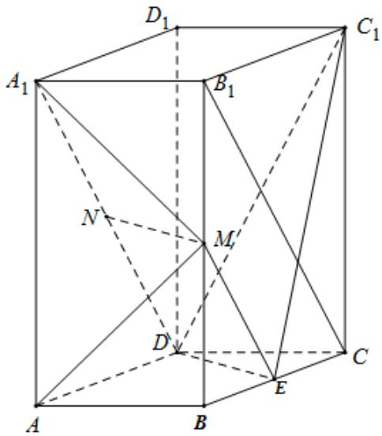
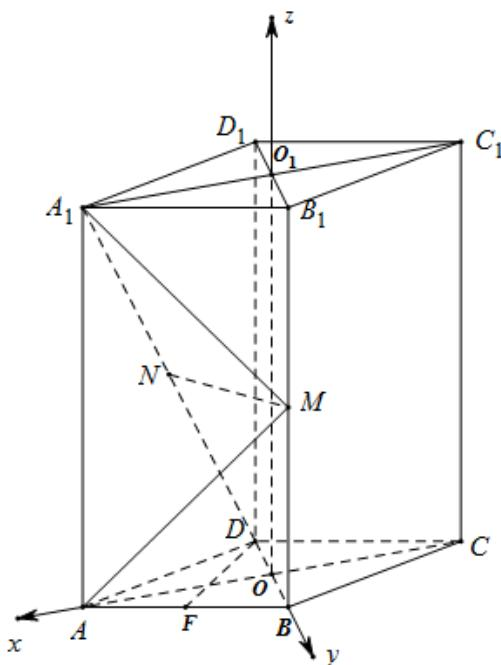
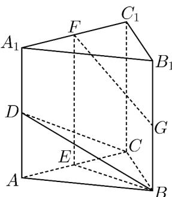
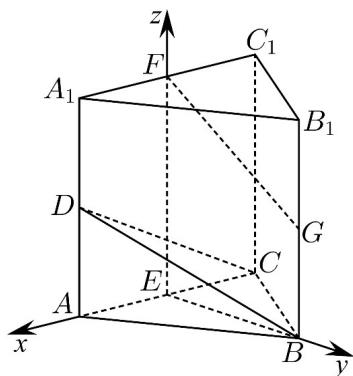
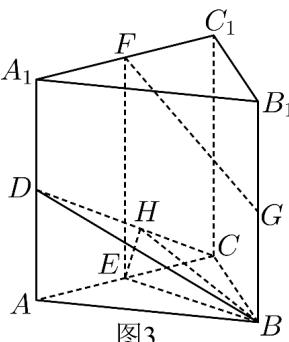
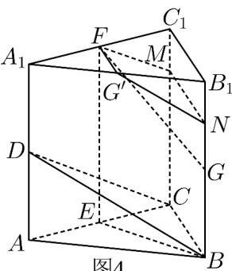
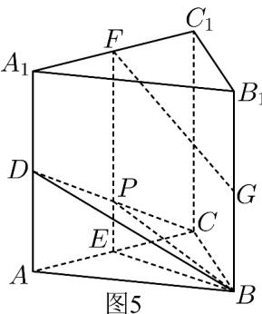

> [!faq]- 《专题21 立体几何大题综合》真题解析
>
> > [!success]- **【答案】** 详见解析
>
> > [!note]- **【分析】**
> > （1）利用三角形中位线和 $A_{1}D \parallel B_{1}C$ 可证得 $ME \parallel ND$ ，证得四边形MNDE为平行四边形，进而证得 $MN \parallel DE$ ，根据线面平行判定定理可证得结论；（2）以菱形ABCD对角线交点为原点可建立空间直角坐标系，通过取 $AB$ 中点 $F$ ，可证得 $DF \perp$ 平面 $AMA_{1}$ ，得到平面 $AMA_{1}$ 的法向量 $DF$ ；再通过向量法求得平面 $MA_{1}N$ 的法向量 $n$ ，利用向量夹角公式求得两个法向量夹角的余弦值，进而可求得所求二面角的正弦值。【详解】（1）连接 $ME$ ， $B_{1}C$
> >
> > 
> >
> > ，分别为 ，中点 为 的中位线
> >
> > $\because M \quad E \quad BB_{1} \quad BC \quad \therefore ME \quad \Delta B_{1}BC$
> >
> > $\therefore ME // B_{1}C$ 且 $ME = \frac{1}{2} B_{1}C$
> >
> > 又 $N$ 为 $A_{1}D$ 中点，且 $A_{1}D \underline{\underline{ // B_{1}C}} \therefore ND // B_{1}C$ 且 $ND = \frac{1}{2} B_{1}C$
> >
> > $\therefore ME \underline{ // ND}$ $\therefore$ 四边形 $MNDE$ 为平行四边形
> >
> > $\therefore MN // DE$ ，又 $MN \not\subset$ 平面 $C_1DE$ ， $DE \subset$ 平面 $C_1DE$
> >
> > ∴MN//平面 $C_{1}DE$
> >
> > (2) 设 $AC \cap BD = O$ ， $A_{1}C_{1} \cap B_{1}D_{1} = O_{1}$
> >
> > 由直四棱柱性质可知： $OO_{1} \perp$ 平面ABCD
> >
> > ∵ 四边形 ABCD 为菱形 ∴ AC ⊥ BD
> >
> > 则以 O 为原点，可建立如下图所示的空间直角坐标系：
> >
> > 
> >
> > 则： $A\left(\sqrt{3},0,0\right)$ ， $M(0,1,2)$ ， $A_{1}\left(\sqrt{3},0,4\right)$ ， $^{D}(0,-1,0)$ $N\left(\frac{\sqrt{3}}{2},-\frac{1}{2},2\right)$
> >
> > 取 $_{AB}$ 中点 $_{F}$ ，连接 $_{DF}$ ，则 $F\left(\frac{\sqrt{3}}{2},\frac{1}{2},0\right)$
> >
> > ∵ 四边形 ABCD 为菱形且 $\angle BAD = 60^{\circ}$ ∴ $\Delta BAD$ 为等边三角形 ∴ $DF \perp AB$ 又 $AA_{1} \perp$ 平面 ABCD， $DF \subset$ 平面 ABCD ∴ $DF \perp AA_{1}$
> >
> > $\therefore DF \perp$ 平面 $ABB_{1}A_{1}$ ，即 $DF \perp$ 平面 $AMA_{1}$
> >
> > $\therefore \stackrel{\square\square\square}{DF}$ 为平面 $AMA_{1}$ 的一个法向量，且 $\stackrel{\square\square\square}{DF} = \left( \frac{\sqrt{3}}{2}, \frac{3}{2}, 0 \right)$
> >
> > 设平面 $MA_{1}N$ 的法向量 $\frac{\Gamma}{n} = (x,y,z)$ ，又 $\overrightarrow{MA_1} = (\sqrt{3}, - 1,2)$ ， $\overrightarrow{MN} = \left(\frac{\sqrt{3}}{2}, - \frac{3}{2},0\right)$
> >
> > $\therefore \left\{ \begin{array}{l} n \cdot MA_{1} = \sqrt{3} x - y + 2z = 0 \\ n \cdot MN = \frac{\sqrt{3}}{2} x - \frac{3}{2} y = 0 \end{array} \right.$ ，令 $x = \sqrt{3}$ ，则 $y = 1$ ， $z = -1$ ， $\therefore n = (\sqrt{3}, 1, -1)$
> >
> > $\therefore \cos < DF, n > = \frac{DF \cdot n}{|DF| \cdot |n|} = \frac{3}{\sqrt{15}} = \frac{\sqrt{15}}{5}$ $\therefore \sin < DF, n > = \frac{\sqrt{10}}{5}$
> >
> > ∴二面角 $A - MA_{1} - N$ 的正弦值为： $\frac{\sqrt{10}}{5}$
> >
> > 【点睛】本题考查线面平行关系的证明、空间向量法求解二面角的问题·求解二面角的关键是能够利用垂直关系建立空间直角坐标系，从而通过求解法向量夹角的余弦值来得到二面角的正弦值，属于常规题型·24．（2018·北京·高考真题）如图，在三棱柱 $ABC-A_{1}B_{1}C_{1}$ 中， $CC_{1}\perp$ 平面ABC，D，E，F，G分别为 $AA_{1}$ ，AC， $A_{1}C_{1}$ ， $BB_{1}$ 的中点， $AB=BC=\sqrt{5}$ ， $AC=AA_{1}=2$ 。
> >
> > 
> >
> > (1) 求证： $AC^{\perp}$ 平面 BEF；
> >
> > (2) 求二面角 $B-CD^{-}C_{l}$ 的余弦值；
> >
> > (3) 证明：直线 FG 与平面 BCD 相交。
> >
> > 【答案】（1）证明见解析；（2） $-\frac{\sqrt{21}}{21}$ ；（3）证明见解析.
> >
> > 【分析】（1）由等腰三角形性质得 $AC \perp BE$ ，由线面垂直性质得 $AC \perp CC_1$ ，由三棱柱性质可得 $EF // CC_1$ ，因此 $EF \perp AC$ ，最后根据线面垂直判定定理得结论；
> >
> > (2) 根据条件建立空间直角坐标系，设各点坐标，利用方程组解得平面 $BCD$ 一个法向量，根据向量数量积求得两法向量夹角，再根据二面角与法向量夹角相等或互补关系求结果；
> >
> > (3) 根据平面 BCD 一个法向量与直线 $F^{G}$ 方向向量数量积不为零，可得结论.
>
> > [!note]- **【解析】**
> > （1）在三棱柱 $ABC-A_{l}B_{l}C_{l}$ 中，
> > $\because CC_{l}\perp$ 平面 ABC，∴四边形 $A_{l}ACC_{l}$ 为矩形。
> > 又 E, F 分别为 AC, $A_{1}C_{1}$ 的中点, $\therefore AC \perp EF$ .
> > ∵AB=BC，E为AC的中点，∴ $AC\perp BE$ ，而 $BE\cap EF=B$
> > $\therefore AC^{\perp}$ 平面 BEF.
> > (2) [方法一]：【通性通法】向量法
> > 由（1）知 $AC \perp EF$ ， $AC \perp BE$ ， $EF \parallel CC_{1}$ 。又 $CC_{1} \perp$ 平面 $ABC$ ，∴ $EF \perp$ 平面 $ABC$ 。
> > ∵BE⊂平面ABC，∴EF⊥BE.
> > 如图建立空间直角坐标系 $E^{-xyz}$ 。
> > 
> > 由题意得 $B(0,2,0)$ ， $C(-1,0,0)$ ， $D(1,0,1)$ ， $F(0,0,2)$ ， $G(0,2,1)$ ：
> > $$
> > \therefore C D = (2 0 1) \quad C B = (1 2, 0)
> > $$
> > 设平面 $BCD$ 的法向量为 $n = (a, b, c)$
> > $$
> > \therefore \left\{\begin{array}{l}n \cdot C D = 0\\\rightarrow \square \square\\n \cdot C B = 0\end{array}, \therefore \left\{\begin{array}{l}2 a + c = 0\\a + 2 b = 0\end{array}\right. \right.
> > $$
> > 令 $a = 2$ ，则 $b = -1$ ， $c = -4$
> > ∴平面 BCD 的一个法向量 $n = (2, -1, -4)$ ,
> > 又∵平面 $CDC_{1}$ 的一个法向量为 $\overrightarrow{EB}=(0,2,0)$ ，∴ $\cos\left\langle n\cdot\overrightarrow{EB}\right\rangle=\frac{n\cdot\overrightarrow{EB}}{\left|n\right|\left|EB\right|}=-\frac{\sqrt{21}}{21}$
> > 由图可得二面角 $B^{-}CD^{-}C_{l}$ 为钝角，所以二面角 $B^{-}CD^{-}C_{l}$ 的余弦值为 $-\frac{\sqrt{21}}{21}$
> > [方法二]：【最优解】转化+面积射影法
> > 考虑到二面角 $B - CD - A$ 与二面角 $B - CD - C_1$ 互补，设二面角 $B - CD - C_1$ 为 $\theta$ ，易知 $DC = \sqrt{5}$ ， $DB = \sqrt{6}$
> > 所以 $S_{\triangle DCE} = \frac{1}{2}, S_{\triangle DCB} = \frac{\sqrt{21}}{2}$
> > 故 $\cos\theta=-\frac{S_{\triangle DCE}}{S_{\triangle DCB}}=-\frac{\frac{1}{2}}{\frac{\sqrt{21}}{2}}=-\frac{\sqrt{21}}{21}$
> > [方法三]：转化+三垂线法
> > 二面角 $B - CD - A$ 与二面角 $B - CD - C_{1}$ 互补，并设二面角 $B - CD - A$ 为 $\theta$ ，易知 $BE \perp$ 平面 $ACD$
> > 如图3，作 $EH \perp CD$ ，垂足为 $H$ ，联结 $BH$ 。则 $\angle BHE$ 是二面角 $B - CD - A$ 的平面角，所以 $\angle BHE = \theta$ ，不难求出 $\cos \theta = \frac{\sqrt{21}}{21}$ ，所以二面角 $B - CD - C_1$ 的余弦值为 $-\frac{\sqrt{21}}{21}$ 。
> > 
> > 图3
> > (3) [方法一]：【最优解】 【通性通法】向量法
> > 平面 $BCD$ 的一个法向量为 $n = (2, -1, -4)$ ， $\because G(0, 2, 1), F(0, 0, 2)$
> > ∴ $GF=\left(0,-2,1\right)$ ，∴ $n\cdot GF=-2$ ，∴ n 与 $GF$ 不垂直，
> > ∴GF 与平面 BCD 不平行且不在平面 BCD 内，∴GF 与平面 BCD 相交。
> > [方法二]：几何转化
> > 如图 $^{4}$ ，取 $A_{1}B_{1}$ 的中点 $G'$ ，分别在 $BB_{1}, CC_{1}$ 取点 N, M，使 $4B_{1}N = BB_{1}, 4C_{1}M = CC_{1}$ 。联结
> > $FG',G'N,NM,FM$ ．则平面DCB∥平面FGNM，又 $FM\subset$ 平面 $FG'NM$ ， $FG\not\subset$ 平面 $FG'NM$ ，故直线FG与平面BCD相交．
> > 
> > 图4
> > [方法三]：根据相交的平面定义
> > 如图 $^{5}$ ，设 CD 与 EF 交于 P，联结 PB。
> > 
> > 因为 $EF \parallel BB_{1}$ ，且 $EF = BB_{1}$ ，所以 B, E, F, $B_{1}$ 四点共面。
> > 因为 $PF = \frac{3}{4} EF, BG = \frac{1}{2} BB_{1}$ ，所以 $PF \neq BG$ 。
> > 又 $PF \parallel BG$ ，所以四边形 $PFGB$ 是梯形，即直线 $FG$ 与直线 $BP$ 一定相交.
> > 因为 $BP \subset$ 平面 $BCD$ ，所以直线 $FG$ 与平面 $BCD$ 相交。
> > 【整体点评】（2）方法一：直接利用向量法求出，属于通性通法；
> > 方法二：根据二面角 B-CD-A 与二面角 $B-CD-C_{1}$ 互补，通过转化求二面角 B-CD-A，利用面积射影法求出，是该问的最优解；
> > 方法三：根据二面角 B-CD-A 与二面角 $B-CD-C_{1}$ 互补，通过转化求二面角 B-CD-A，利用三垂线法求出；
> > （3）方法一：利用向量证明平面的法向量与直线的方向向量不垂直即可，既是该问的通性通法，也是最优解；
> > 方法二：通过证明与平面 $BCD$ 平行的平面与直线 $FG$ 相交证出；
> > 方法三：构建过直线 $FG$ 且与平面 $BCD$ 相交的平面，通过证明直线 $FG$ 与交线相交证出.
