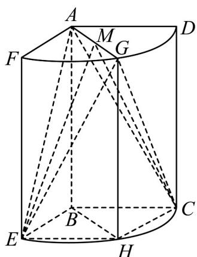
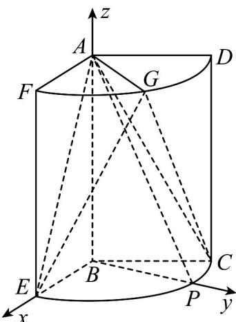

> [!faq]- 《专题21 立体几何大题综合》真题解析
>
> > [!success]- **【答案】** 详见解析
>
> > [!note]- **【分析】**
> > 【分析】试题分析:(1)第(1)问,直接证明 $BE \perp$ 平面ABP得到 $BE \perp BP$ ,从而求出 $z^{CBP}$ 的大小.(2)第(2)问,可以利用几何法求,也可以利用向量法求解.
>
> > [!note]- **【解析】**
> > 【详解】解：
> > (1)
> > 
> > 因为 $AP \perp BE$ ， $AB \perp BE$ ，AB， $AP \subset$ 平面 ABP， $AB \cap AP = A$ ，所以 $BE \perp$ 平面 ABP.
> > 又 $BP \subset$ 平面 $ABP$ ，所以 $BE \perp BP$ . 又 $\angle EBC = 120^{\circ}$ ，所以 $\angle CBP = 30^{\circ}$ .
> > (2)方法一：如图，取 $EC$ 的中点 $\mathsf{H}$ ，连接 $\mathrm{EH}$ ， $\mathrm{GH}$ ， $\mathrm{CH}$ .
> > 因为 $\angle EBC = 120^{\circ}$ ，所以四边形BEHC为菱形，
> > 所以 $\mathrm{AE} = \mathrm{GE} = \mathrm{AC} = \mathrm{GC} = \sqrt{3^2 + 2^2} = \sqrt{13}$ .
> > 取 AG 的中点 M，连接 EM，CM，EC，
> > 则 $EM \perp AG$ ，CM⊥AG
> > 所以 $\angle EMC$ 为所求二面角的平面角.
> > 又 $AM = 1$ ，所以 $EM = CM = \sqrt{13 - 1} = 2\sqrt{3}$
> > 在 $\triangle BEC$ 中，由于 $\angle EBC = 120^{\circ}$
> > 由余弦定理得 $EC^{2}=2^{2}+2^{2}-2\times2\times2\times\cos120^{\circ}=12$
> > 所以 $EC = 2\sqrt{3}$ ，所以 $\triangle EMC$ 为等边三角形，
> > 故所求的角为 $60^{\circ}$ .
> > 方法二：
> > 
> > 以 B 为坐标原点，分别以 BE，BP，BA 所在的直线为 x，y，z 轴，建立如图所示的空间直角坐标系 B-xyz.
> > 由题意得 A(0,0,3)，E(2,0,0)，G(1， $\sqrt{3}$ ，3)，C(-1， $\sqrt{3}$ ，0)
> > 故 $\stackrel{\square\square}{AE}=(2,0,\quad-3)$ ， $\stackrel{\square\square}{AG}=(1,\sqrt{3},0)$ ， $\stackrel{\square\square}{CG}=(2,0,3)$
> > 设 $m = (x_{1}, y_{1}, z_{1})$ 是平面 AEG 的一个法向量，
> > 由 $\left\{\begin{aligned}&m\cdot AE=0\\ &m\cdot AG=0\end{aligned}\right.$ 可得 $\left\{\begin{aligned}&2x_{1}-3z_{1}=0\\ &x_{1}+\sqrt{3}y_{1}=0\end{aligned}\right.$
> > 取 $z_{1} = 2$ ，可得平面AEG的一个法向量 $m = (3, -\sqrt{3}, 2)$
> > 设 $n = (x_{2}, y_{2}, z_{2})$ 是平面ACG的一个法向量.
> > 由 $\left\{\begin{aligned}n\cdot AG&=0\\ n\cdot CG&=0\end{aligned}\right.$ 可得 $\left\{\begin{aligned}x_{2}&+\sqrt{3}y_{2}=0\\ 2x_{2}&+3z_{2}=0\end{aligned}\right.$
> > 取 $z_{2} = -2$ ，可得平面ACG的一个法向量 $\mathbf{n} = (3, -\sqrt{3}, -2)$
> > 所以 $\cos\left\langle\begin{matrix}\square\\ m,n\end{matrix}\right\rangle=\frac{\square m\cdot n}{|m||n|}=\frac{1}{2}\cdot$
> > 故所求的角为 $60^{\circ}$
> > 点睛：本题的难点主要是计算，由于空间向量的运算，所以大家在计算时，务必仔细认真。
