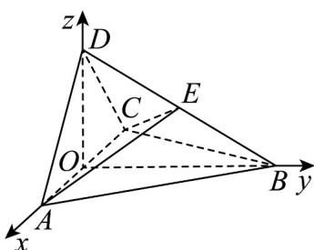

> [!faq]- 《专题21 立体几何大题综合》真题解析
>
> > [!success]- **【答案】** $(1)$ 见解析； $(2) \frac{\sqrt{7}}{7}$ 【详解】试题分析：（1）利用题意证得二面角的平面角为 $90^{\circ}$ ，则可得到面面垂直； (2) 利用题意求得两个半平面的法向量，然后利用二面角的夹角公式可求得二面角 $D-AE-C$ 的余弦值为 $\frac{\sqrt{7}}{7}$ . 试题
>
> > [!note]- **【分析】**
> > 本题未单列分析。
>
> > [!note]- **【解析】**
> > （1）由题设可得， $\triangle ABD \cong \triangle CBD$ ，从而 $AD = DC$ .
> > 又 $\triangle ACD$ 是直角三角形，所以 $\angle ADC = 90^{\circ}$ .
> > 取 AC 的中点 O，连接 DO, BO，则 $DO \perp AC, DO = AO.$
> > 又由于 $\triangle ABC$ 是正三角形，故 $BO \perp AC$ .
> > 所以 $\angle DOB$ 为二面角 D-AC-B 的平面角.
> > 在 $Rt\triangle AOB$ 中， $BO^{2} + AO^{2} = AB^{2}$
> > 又 $AB = BD$ ，所以 $BO^{2} + DO^{2} = BO^{2} + AO^{2} = AB^{2} = BD^{2}$
> > 故 $\angle DOB = 90^{\circ}$
> > 所以平面 $ACD \perp$ 平面 ABC.
> > $$
> > (^ {2})
> > $$
> > $$
> > ( \begin{array}{c} 1 \\ \hline \end{array} )
> > $$
> > $$
> > O A, O B, O D
> > $$
> > $$
> > o
> > $$
> > $$
> > \stackrel {\mathrm{uu}} {O A}
> > $$
> > $$
> > \left| \stackrel {{\text { 一 }}} {{O A}} \right|
> > $$
> > $$
> > O - x y z \cdot \text {则}
> > $$
> > $$
> > A (1, 0, 0), B (0, \sqrt {3}, 0), C (- 1, 0, 0), D (0, 0, 1)
> > $$
> > 
> > 由题设知，四面体 $^{ABCE}$ 的体积为四面体 $^{ABCD}$ 的体积的 $\frac{1}{2}$ ，从而 $^{E}$ 到平面 $^{ABC}$ 的距离为 $^{D}$ 到平面 $^{ABC}$ 的距离的 $\frac{1}{2}$ ，即 $^{E}$ 为 $^{DB}$ 的中点，得 $E\left(0, \frac{\sqrt{3}}{2}, \frac{1}{2}\right)$ .
> > 故 $\overrightarrow{AD}=\left(-1,0,1\right),\overrightarrow{AC}=\left(-2,0,0\right),\overrightarrow{AE}=\left(-1,\frac{\sqrt{3}}{2},\frac{1}{2}\right).$
> > 设 $n = (x,y,z)$ 是平面 $^{DAE}$ 的法向量，则 $\left\{ \begin{array}{l} n \cdot \overline{AD} = 0 \\ n \cdot AE = 0 \end{array} \right.$ 即 $\left\{ \begin{array}{l} -x + z = 0, \\ -x + \frac{\sqrt{3}}{2} y + \frac{1}{2} z = 0. \end{array} \right.$
> > 可取 $n=\left(1,\frac{\sqrt{3}}{3},1\right)$ .
> > 设 $m$ 是平面 $AEC$ 的法向量，则 $\left\{ \begin{array}{l} m \cdot AC = 0 \\ m \cdot AE = 0 \end{array} \right.$ 同理可取 $m = (0, -1, \sqrt{3}) \cdot$
> > 则 $\cos\left\langle n,m\right\rangle=\frac{n\cdot m}{|n||m|}=\frac{\sqrt{7}}{7}$ .
> > 所以二面角 $D-AE-C$ 的余弦值为 $\frac{\sqrt{7}}{7}$ .
> > 【名师点睛】（ $^{1}$ ）求解本题要注意两点：一是两平面的法向量的夹角不一定是所求的二面角，二是利用方程思想进行向量运算时，要认真细心，准确计算·
> > (2) 设 m, n 分别为平面 $\alpha$ , $\beta$ 的法向量，则二面角 $\theta$ 与 $\langle m, n \rangle$ 互补或相等，故有 $\left|\cos\theta\right|=\left|\cos m,n\right|=\frac{m\cdot n}{\left|m\right|\left|n\right|}$ ·求解时一定要注意结合实际图形判断所求角是锐角还是钝角.
