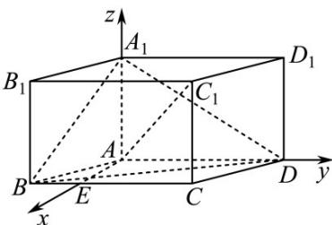

> [!faq]- 《专题21 立体几何大题综合》真题解析
>
> > [!success]- **【答案】** (1)求异面直线 $A_{1}B$ 与 $AC_{1}$ 所成角的余弦值； (2)求二面角 $B - A_{1}D - A$ 的正弦值. 【答案】(1) $\frac{1}{7}$ . (2) $\frac{\sqrt{7}}{4}$
>
> > [!note]- **【分析】**
> > 本题未单列分析。
>
> > [!note]- **【解析】**
> > 试题解析：解：在平面 $ABCD$ 内，过点 $A$ 作 $AE \perp AD$ ，交 $BC$ 于点 $E$ .
> > 因为 $AA_{1} \perp$ 平面ABCD
> > 所以 $AA_{1} \perp AE$ ， $AA_{1} \perp AD.$
> > 如图，以 $\left\{AE,AD,AA_{1}\right\}$ 为正交基底，建立空间直角坐标系A-xyz.
> > 因为 AB=AD=2， $AA_{1}=\sqrt{3}$ ， $\angle BAD=120^{\circ}$
> > 则 $A(0,0,0),B(\sqrt{3}, - 1,0),D(0,2,0),E(\sqrt{3},0,0),A_1(0,0,\sqrt{3}),C_1(\sqrt{3},1,\sqrt{3}).$
> > (1) $A_{1}B = (\sqrt{3}, - 1, - \sqrt{3}),A C_{1} = (\sqrt{3},1,\sqrt{3})$
> > $$
> > \cos \left\langle A _ {1} B, A C _ {1} \right\rangle = \frac {\square \square \square}{\square \square \square} \frac {\square \square \square}{A _ {1} B \cdot A C _ {1}} = \frac {\left(\sqrt {3} , - 1 , - \sqrt {3}\right) \cdot \left(\sqrt {3} , 1 , \sqrt {3}\right)}{7} = - \frac {1}{7}.
> > $$
> > 因此异面直线 $A_{1}B$ 与 $AC_{1}$ 所成角的余弦值为 $\frac{1}{7}$ .
> > 
> > (2)平面 $A_{1}DA$ 的一个法向量为 $AE = (\sqrt{3}, 0, 0)$ .
> > 设 $m=\left(x,y,z\right)$ 为平面 $BA_{1}D$ 的一个法向量，
> > 又 $A_{1}B = (\sqrt{3}, - 1, - \sqrt{3}),\overline{BD} = (- \sqrt{3},3,0)$
> > 则 $\left\{\begin{aligned}&m\cdot\stackrel{\square\square}{A}B=0,\\ &m\cdot BD=0,\end{aligned}\right.$ 即 $\left\{\begin{aligned}&\sqrt{3}x-y-\sqrt{3}z=0,\\&-\sqrt{3}x+3y=0.\end{aligned}\right.$
> > 不妨取 $x = 3$ ，则 $y = \sqrt{3}, z = 2$
> > 所以 $m = (3, \sqrt{3}, 2)$ 为平面 $BA_{1}D$ 的一个法向量，
> > 从而 $\cos\left\langle\overrightarrow{AE},\overrightarrow{m}\right\rangle=\frac{\overrightarrow{AE}\cdot\overrightarrow{m}}{\left|AE\right|\left|m\right|}=\frac{\left(\sqrt{3},0,0\right)\cdot\left(3,\sqrt{3},2\right)}{\sqrt{3}\times4}=\frac{3}{4}$
> > 设二面角 $B-A_{1}D-A$ 的大小为 $\theta$ ，则 $\left|\cos\theta\right|=\frac{3}{4}$ .
> > 因为 $\theta \in [0,\pi ]$ ，所以 $sin\theta = \sqrt{1 - \cos^2\theta} = \frac{\sqrt{7}}{4}$
> > 因此二面角 $B - A_{1}D - A$ 的正弦值为 $\frac{\sqrt{7}}{4}$
