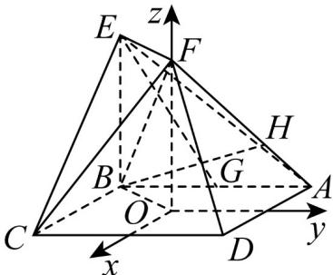

> [!faq]- 《专题21 立体几何大题综合》真题解析
>
> > [!success]- **【答案】** （Ⅰ）详见解析；（Ⅱ） $\frac{\sqrt{3}}{3}$ ；（Ⅲ） $\frac{\sqrt{7}}{21}$ 【详解】试题分析：（Ⅰ）利用空间向量证明线面平行，关键是求出平面的法向量，利用法向量与直线方向向量垂直进行论证；（Ⅱ）利用空间向量求二面角，关键是求出平面的法向量，再利用向量数量积求出法向量夹角，最后根据向量夹角与二面角相等或互补关系求正弦值；（Ⅲ）利用空间向量求线面角，关键是求出平面的法向量，再利用向量数量积求出向量夹角，最后根据向量夹角与线面角互余关系求正弦值·试题
>
> > [!note]- **【分析】**
> > 本题未单列分析。
>
> > [!note]- **【解析】**
> > 依题意， $OF \perp$ 平面ABCD，如图，以O为点，分别以AD,BA,OF的方向为x轴、y轴、z轴的正方向建立空间直角坐标系，依题意可得 $O(0,0,0)$ ，
> > $A\big(-1,1,0\big),B(-1,-1,0),C(1,-1,0),D(11,0),E(-1,-1,2),F(0,0,2),G(-1,0,0)$
> > 
> > (Ⅰ) 证明：依题意， $\overline{AD}=(2,0,0),\overline{AF}=(1,-1,2)$ .
> > 设 $n_1 = (x, y, z)$ 为平面 $ADF$ 的法向量，则 $\left\{ \begin{array}{l} n_1 \cdot AD = 0 \\ n_1 \cdot AF = 0 \end{array} \right.$ ，即 $\left\{ \begin{array}{l} 2x = 0 \\ x - y + 2z = 0 \end{array} \right.$ .
> > 不妨设 $z = 1$ ，可得 $\stackrel{\square}{n}_{1} = (0,2,1)$ ，又 $EG = (0,1, - 2)$ ，可得 $EG\cdot n_{1} = 0$
> > 又因为直线 $EG \notin$ 平面 $ADF$ ，所以 $EG //$ 平面 $ADF$ .
> > (Ⅱ) 解：易证， $OA = (-1, 1, 0)$ 为平面 OEF 的一个法向量.
> > 依题意， $EF = (1,1,0), CF = (-1,1,2)$ .
> > 设 $n_2 = (x, y, z)$ 为平面 $CEF$ 的法向量，则 $\begin{cases} n_2 \cdot EE = 0 \\ n_2 \cdot CF = 0 \end{cases}$ ，即 $\begin{cases} x + y = 0 \\ -x + y + 2z = 0 \end{cases}$ .
> > 不妨设 x=1 ，可得 $n_{2}^{□□}= \left(1,-1,1\right)$ .
> > 因此有 $\cos \left\langle \overrightarrow{OA}, n_2 \right\rangle = \frac{\overrightarrow{OA} \cdot \overrightarrow{n}}{\left|OA\right| \cdot \left|n_2\right|} = -\frac{\sqrt{6}}{3}$ ，于是 $\sin \left\langle \overrightarrow{OA}, n_2 \right\rangle = \frac{\sqrt{3}}{3}$
> > 所以，二面角 $O - EF - C$ 的正弦值为 $\frac{\sqrt{3}}{3}$
> > (Ⅲ) 解：由 $AH = \frac{2}{3}HF$ ，得 $AH = \frac{2}{5}AF$ .
> > 因为 $\overrightarrow{AF} = (1, -1, 2)$ ，所以 $AH = \frac{2}{5} AF = \left(\frac{2}{5}, -\frac{2}{5}, \frac{4}{5}\right)$ ，进而有 $H\left(-\frac{3}{5}, \frac{3}{5}, \frac{4}{5}\right)$ ，从而 $BH = \left(\frac{2}{5}, \frac{8}{5}, \frac{4}{5}\right)$ ，因此 $\cos \left\langle \overrightarrow{BH}, n_2 \right\rangle = \frac{\overrightarrow{BH} \cdot n_2}{\left| BH \right| \cdot \left| n_2 \right|} = -\frac{\sqrt{7}}{21}$ .
> > 所以，直线 $BH$ 和平面 $CEF$ 所成角的正弦值为 $\frac{\sqrt{7}}{21}$
> > 【考点】利用空间向量解决立体几何问题
