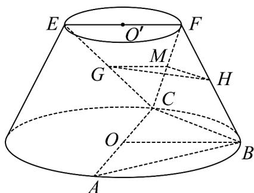
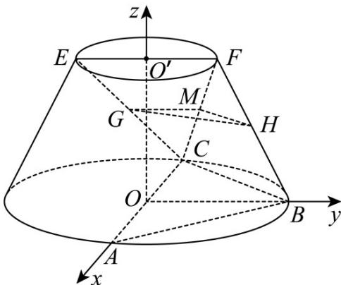

> [!faq]- 《专题21 立体几何大题综合》真题解析
>
> > [!success]- **【答案】** 详见解析
>
> > [!note]- **【分析】**
> > 本题未单列分析。
>
> > [!note]- **【解析】**
> > 【答案】（Ⅰ）见解析；（Ⅱ） $\frac{\sqrt{7}}{7}$
> > 【详解】 $^{(l)}$ 连结 FC，取 FC 的中点 M，连结 GM，HM，
> > 
> > ∵ GM // EF 、 EF 在上底面内，GM 不在上底面内，∴ GM // 上底面，
> > ∴ GM // 平面 ABC ，又∵ MH//BC ， BC ⊂ 平面 ABC ， MH ∉ 平面 ABC ，
> > ∴ MH // 平面 ABC ，
> > 所以平面GHM//平面ABC，由GH⊂平面GHM，∴GH//平面ABC
> > (II)连结OB，∵ AB = BC，OA ⊥ OB
> > 以 O 为原点，分别以 OA，OB， $OO'$ 为 x，y，z 轴建立空间直角坐标系，
> > 
> > $\because EF = FB = \frac{1}{2} AC = 2\sqrt{3}$ , $AB = BC$ , $OO' = \sqrt{BF^2 - (BO - FO)^2} = 3$
> > 于是有 $A(2\sqrt{3},0,0)$ ， $C(-2\sqrt{3},0,0)$ ， $B(0,2\sqrt{3},0)$ ， $F(0,\sqrt{3},3)$
> > 可得平面 $FBC$ 中的向量 $\overline{BF} = (0, -\sqrt{3}, 3)$ ， $\overline{CB} = (2\sqrt{3}, 2\sqrt{3}, 0)$
> > 设平面 $FBC$ 中的法向量 $\stackrel{\Gamma}{n} = (x,y,z)$
> > 则 $\left\{ \begin{array}{l} n \cdot BF = -\sqrt{3} y + 3z = 0 \\ n \cdot CB = 2\sqrt{3} x + 2\sqrt{3} y = 0 \end{array} \right.$
> > 于是得平面 $FBC$ 的一个法向量 $\overline{n_1} = (-\sqrt{3},\sqrt{3},1)$
> > 又平面 $ABC$ 的一个法向量 $\overline{n_2} = (0,0,1)$
> > 设二面角 $F - BC - A$ 为 $\theta$ ，则 $\cos \theta = \frac{\square n_1 \cdot n_2}{\left|n_1\right| \cdot \left|n_2\right|} = \frac{1}{\sqrt{7}} = \frac{\sqrt{7}}{7}$ ，
> > 二面角 $F - BC - A$ 的余弦值为 $\frac{\sqrt{7}}{7}$ .
> > 考点：直线与平面平行的判定；二面角的平面及求法·
> > 【方法点睛】本题考查线面平行的证明，考查二面角的余弦值的求法，是中档题，解题时要认真审题，注意向量法的合理运用；直线与平面平行的判定定理的实质是：对于平面外的一条直线，只需在平面内找到一条直线和这条直线平行，就可判定这条直线必和这个平面平行．即由线线平行得到线面平行，向量法：
> > 两平面所成的角的大小与分别垂直于这平面的两向量所成的角（或补角）相等·
