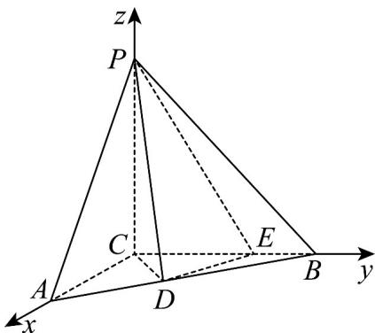

> [!faq]- 《专题21 立体几何大题综合》真题解析
>
> > [!success]- **【答案】** (1)证明： $DE \perp$ 平面PCD； (2)求二面角 A - PD - C 的余弦值. 【答案】 $(1)$ 见解析； $(2)$ $\frac{\sqrt{3}}{6}$
>
> > [!note]- **【分析】**
> > 本题未单列分析。
>
> > [!note]- **【解析】**
> > 试题分析：（1）要证线面垂直，就是要证线线垂直，题中由 $PC \perp$ 平面 $ABC$ ，可知 $PC \perp DE$ ，再分析已知由 $DC = DE = \sqrt{2}, CE = 2$ 得 $CD \perp DE$ ，这样与 $DE$ 垂直的两条直线都已找到，从而可得线面垂直；（2）求二面角的大小，可心根据定义作出二面角的平面角，求出这个平面角的大小，本题中，由于 $\angle ACB = \frac{\pi}{2}$ ， $PC \perp$ 平面 $ABC$ ，因此 $CA, CB, CP$ 两两垂直，可以他们为 $x, y, z$ 轴建立空间直角坐标系，写出图中各点的坐标，求出平面 $APD$ 和平面 $CPD$ 的法向量 $n_1, n_2$ ，向量 $n_1, n_2$ 的夹角与二面角相等或互补，由此可得结论。
> > 试题解析：（1）证明：由PC⊥平面ABC，DE⊂平面ABC，故PC⊥DE
> > 由 $CE = 2$ ， $CD = DE = \sqrt{2}$ 得 $\Delta CDE$ 为等腰直角三角形，故 $CD \perp DE$
> > 由 $\mathrm{PC} \cap \mathrm{CD} = \mathrm{C}$ ，DE 垂直于平面 PCD 内两条相交直线，故 DE⊥平面 PCD
> > (2) 解：由（1）知， $\Delta^{CDE}$ 为等腰直角三角形， $\angle^{DCE}=\frac{\pi}{4}$ ，如（19）图，过点 D 作 $^{DF}$ 垂直 $^{CE}$ 于 F，
> > 易知 $DF = FC = EF = 1$ ，又已知 EB = 1，
> > 故 $FB = 2$
> > 由 $\angle ACB = \frac{\pi}{2}$ 得 $DF_{//}AC$ ， $\frac{DF}{AC} = \frac{FB}{BC} = \frac{2}{3}$ ，故 $AC = \frac{3}{2} DF = \frac{3}{2}$
> > 以C为坐标原点，分别以 $\overset{\mathrm{UUU}}{CA}\overset{\mathrm{UUU}}{CB},\overset{\mathrm{UUU}}{CP}$ 的方程为 $^{X}$ 轴， $^{Y}$ 轴， $^{Z}$ 轴的正方向建立空间直角坐标系，则C
> > $(0,0,0)$ , $P(0,0,3)$ , $A(\frac{3}{2},0,0)$ , $E(0,2,0)$ , $D(1,1,0)$ , $\overline{ED}=(1,-1,0)$ ,
> > $$
> > \begin{array}{c} \square \square \square \\ D P = (- 1, - 1, 3) \quad \square \square \square \\ D A = (\frac {1}{2}, - 1, 0) \end{array}
> > $$
> > 设平面 PAD 的法向量 $n_{1}=(x_{1},y_{1},z_{1})$
> > 由 $n_1 \cdot DP = 0$ ， $n_1 \cdot DA = 0$
> > 
> > $-x_{1}-y_{1}+3z_{1}=0$ 得 $\left\{\frac{1}{2}x_{1}-y_{1}=0\right.$ 故可取 $n_{1}=(2,1,1)$ .
> > 由（1）可知 $\mathrm{DE} \perp$ 平面 $\mathrm{PCD}$ ，故平面 $\mathrm{PCD}$ 的法向量 $n_2$ 可取为 $\mathrm{ED}$ ，即 $n_2 = (1, -1, 0)$ .
> > 从而法向量 $\frac{\mathrm{u}}{n_1}$ ， $\frac{\mathrm{uu}}{n_2}$ 的夹角的余弦值为 $cos\langle n_1,n_2\rangle = \frac{\frac{\mathrm{u}}{\mathrm{n}_1}\cdot\frac{\mathrm{uu}}{\mathrm{n}_2}}{|n_1|\cdot|n_2|} = \frac{\sqrt{3}}{6}$
> > 故所求二面角 A-PD-C 的余弦值为 $\frac{\sqrt{3}}{6}$ .
> > 考点：考查线面垂直，二面角．考查空间想象能力和推理能力．
