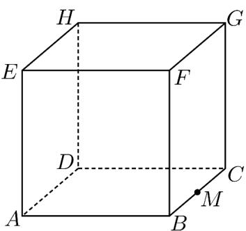
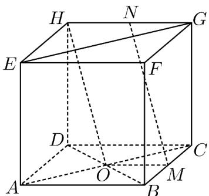
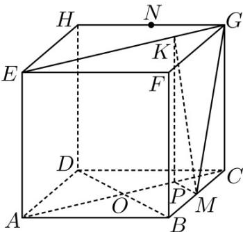

> [!faq]- 《专题21 立体几何大题综合》真题解析
>
> > [!success]- **【答案】** 详见解析
>
> > [!note]- **【分析】**
> > 【分析】（1）根据展开图在图中作出·
> >
> > (2) 线面线面平行的判定即可；
> >
> > (3) 根据二面角定义作出该角，求出其余弦值即可·
>
> > [!note]- **【解析】**
> > 【详解】（1）点 $F$ 、 $G$ 、 $H$ 的位置如图所示
> > 
> > (2) 连结 BD，设 O 为 BD 的中点.
> > 
> > 因为 M、N 分别是 BC、GH 的中点，
> > 所以 $NH // CD$ ，且 $NH = \frac{1}{2} CD$
> > $MN//OH$ ，且 $NH=\frac{1}{2}CD$ ，
> > 所以 $OM / / NH, OM = NH$
> > 所以 $\angle PKM$ 是平行四边形，从而 $MP \perp AC$
> > 又 $OH \subset$ 平面 BDH ，MN // 平面 BDH ，MN ∉ 平面 BDH ，
> > 所以 $MN / /$ 平面BDH·
> > (3) 连结 AC，过 M 作 $AC \parallel EG$ 于 P.
> > 
> > 在正方形 $CM = 1, PK = 2$ 中， $AC // EG$
> > 所以 $KM \perp EG$ .
> > 过 P 作 $PK \perp EG$ 于 K，连结 KM，因为 $KM \cap PK = K$ ，且 $KM, PK \subset$ 平面 PKM，
> > 所以 $EG \perp$ 平面 PKM ，又因为 $KM \subset$ 平面 PKM ，从而 $KM \perp EG$ .
> > 所以 $\angle PKM$ 是二面角 $A - EG - M$ 的平面角.
> > 设 $AD = 2$ ，则 $CM = 1, PK = 2$
> > 在 Rt△CMP 中， $PM = CM \sin 45^{\circ} = \frac{\sqrt{2}}{2}$ .
> > 在 Rt△KMP 中， $KM = \sqrt{PK^{2} + PM^{2}} = \frac{3\sqrt{2}}{2}$ .
> > 所以 $\cos\angle PKM=\frac{PK}{KM}=\frac{2\sqrt{2}}{3}$
> > 即二面角 $A - EG - M$ 的余弦值为 $\frac{2\sqrt{2}}{3}$
