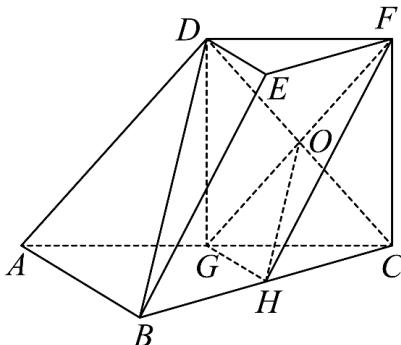
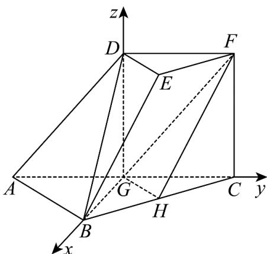
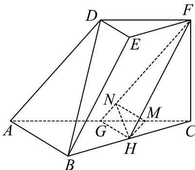

> [!faq]- 《专题21 立体几何大题综合》真题解析
>
> > [!success]- **【答案】** (1) 求证： $BD \parallel$ 平面 FGH； (Ⅱ) 若 $CF \perp$ 平面 ABC, $AB \perp BC$ , CF = DE, $\angle BAC = 45^{\circ}$ ，求平面FGH与平面ACFD所成角（锐角）的大小. 【答案】（Ⅰ）略；（Ⅱ） $60^{\circ}$
>
> > [!note]- **【分析】**
> > 本题未单列分析。
>
> > [!note]- **【解析】**
> > 试题分析：（Ⅰ）思路一：连接 DG, CD，设 $CD \cap GF = O$ ，连接 OH，先证明 $OH \parallel BD$ ，从而由直线与平面平行的判定定理得 BD // 平面 HDF；思路二：先证明平面 FGH // 平面 ABED，再由平面与平面平行的定义得到 BD // 平面 HDF。
> > （Ⅱ）思路一：连接 $DG, CD$ ，设 $CD \cap GF = O$ ，连接 $OH$ ，证明 $GB, GC, GD$ 两两垂直，以 $G$ 为坐标原点，建立如图所示的空间直角坐标系 $G - xyz$ ，利用空量向量的夹角公式求解；思路二：作 $HM \perp AC$ 于点 $M$ ，作 $MN \perp GF$ 于点 $N$ ，连接 $NH$ ，证明 $\angle MNH$ 即为所求的角，然后在三角形中求解。
> > 试题解析：
> > (Ⅰ) 证法一：连接 DG, CD，设 $CD \cap GF = O$ ，连接 OH，
> > 在三棱台 $DEF - ABC$ 中，
> > $AB = 2DE, G$ 为 $AC$ 的中点
> > 可得 $DF / / GC,DF = GC$
> > 所以四边形 DFCG 为平行四边形
> > 则 $O$ 为 $CD$ 的中点
> > 又 $H$ 为 $BC$ 的中点
> > 所以 $OH \parallel BD$
> > 又 $OH \subset$ 平面 $FGH, BD \subset$ 平面 $FGH$ ,
> > 所以 $BD / /$ 平面FGH
> > 
> > 证法二：
> > 在三棱台 $DEF - ABC$ 中，
> > 由 BC = 2EF, H 为 BC 的中点
> > 可得 $BH / / EF, BH = EF,$
> > 所以四边形 BHFE 为平行四边形
> > 可得 $BE / / HF$
> > 在 $\Delta ABC$ 中，G 为 AC 的中点，H 为 BC 的中点，
> > 所以 GH // AB
> > 又 $GH \cap HF = H$ ，所以平面 $FGH //$ 平面 $ABED$
> > 因为 $BD \subset$ 平面ABED
> > 所以 $BD / /$ 平面FGH
> > (Ⅱ) 解法一：
> > 设 $AB = 2$ ，则 $CF = 1$
> > 在三棱台 $DEF - ABC$ 中，
> > $G$ 为 $AC$ 的中点
> > 由 $DF = \frac{1}{2} AC = GC$
> > 可得四边形 DGCF 为平行四边形，
> > 因此 $DG // CF$
> > 又 $FC \perp$ 平面 $ABC$
> > 所以 $DG \perp$ 平面 $ABC$
> > 在 $\Delta ABC$ 中，由 $AB \perp BC, \angle BAC = 45^{\circ}$ ， $G$ 是 $AC$ 中点，
> > 所以 $AB = BC, GB \perp GC$
> > 因此 GB, GC, GD 两两垂直，
> > 以 G 为坐标原点，建立如图所示的空间直角坐标系 G - xyz
> > 
> > 所以 $G(0,0,0)$ , $B(\sqrt{2},0,0)$ , $C(0,\sqrt{2},0)$ , $D(0,0,1)$
> > 可得 $H\left(\frac{\sqrt{2}}{2}, \frac{\sqrt{2}}{2}, 0\right), F(0, \sqrt{2}, 1)$
> > 故 $\overrightarrow{GH}=\left(\frac{\sqrt{2}}{2},\frac{\sqrt{2}}{2},0\right),\overrightarrow{GF}=\left(0,\sqrt{2},1\right)$
> > 设 $n = (x,y,z)$ 是平面FGH的一个法向量，则
> > 由 $\left\{\begin{aligned}&n\cdot GH=0,\\ &n\cdot GF=0,\end{aligned}\right.$ 可得 $\left\{\begin{aligned}&x+y=0\\\sqrt{2}y+z=0\end{aligned}\right.$
> > 可得平面 FGH 的一个法向量 $n = \left(1, -1, \sqrt{2}\right)$
> > 因为 $\stackrel{\square\square}{GB}$ 是平面 ACFD 的一个法向量， $\stackrel{\square\square\square}{GB} = (\sqrt{2}, 0, 0)$
> > 所以 $\cos\left\langle\overrightarrow{GB},\overrightarrow{n}\right\rangle=\frac{\overrightarrow{GB}\cdot n}{\left|GB\right|\cdot\left|n\right|}=\frac{\sqrt{2}}{2\sqrt{2}}=\frac{1}{2}$
> > 所以平面与平面所成的解（锐角）的大小为 $60^{\circ}$
> > 解法二：
> > 作 $HM \perp AC$ 于点 $M$ ，作 $MN \perp GF$ 于点 $N$ ，连接 $NH$
> > 由 $FC \perp$ 平面 $ABC$ ，得 $HM \perp FC$
> > 又 $FC\cap AC = C$
> > 所以 $HM \perp$ 平面 $ACFD$
> > 因此 $GF \perp NH$
> > 所以 $\angle MNH$ 即为所求的角
> > 
> > 在 $\Delta BGC$ 中， $MH // BG, MH = \frac{1}{2} BG = \frac{\sqrt{2}}{2}$ ，
> > 由 $\Delta GNM\sim \Delta GCF$
> > 可得 $\frac{MN}{FC}=\frac{GM}{GF}$ ,
> > 从而 $MN = \frac{\sqrt{6}}{6}$
> > 由 $MH \perp$ 平面 $ACFD, MN \subset$ 平面 $ACFD$
> > 得 $MH \perp MN,$
> > 因此 $\tan \angle MNH = \frac{HM}{MN} = \sqrt{3}$
> > 所以 $\angle MNH = 60^{\circ}$
> > 所以平面 $FGH$ 与平面 $ACFD$ 所成角（锐角）的大小为 $60^{\circ}$
> > 考点： $^{1}$ 、空间直线与平面的位置关系； $^{2}$ 、二面角的求法； $^{3}$ 、空间向量在解决立体几何问题中的应用。
