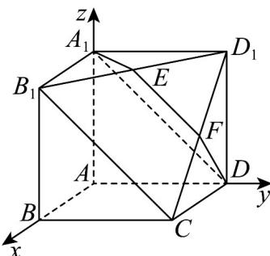

> [!faq]- 《专题21 立体几何大题综合》真题解析
>
> > [!success]- **【答案】** （Ⅰ） $EF // B_{1}C$ ；（Ⅱ） $\frac{\sqrt{6}}{3}$
>
> > [!note]- **【分析】**
> > 本题未单列分析。
>
> > [!note]- **【解析】**
> > 试题分析：（Ⅰ）证明：依据正方形的性质可知 $A_{1}B_{1} // AB // DC$ ，且 $A_{1}B_{1} = AB = DC$ ，，从而 $A_{1}B_{1}CD$ 为平行四边形，则 $B_{1}C // A_{1}D$ ，根据线面平行的判定定理知 $B_{1}C // \text{面 } A_{1}DE$ ，再由线面平行的性质定理知 $EF // B_{1}C \cdot (\text{Ⅱ})$ 因为四边形 $AA_{1}B_{1}B$ ， $ADD_{1}A_{1}$ ， $ABCD$ 均为正方形，所以
> > $AA_{1} \perp AB, AA_{1} \perp AD, AD \perp AB$ ，且 $AA_{1} = AB = AD$ ，可以建以 A 为原点，分别以 $AB, AD, AA_{1}$ 为 x 轴，y 轴，z 轴单位正向量的平面直角坐标系，写出相关的点的坐标，设出面 $A_{1}DE$ 的法向量 $n_{1} = (r_{1}, s_{1}, t_{1}) \cdot$ 由
> > $n_{1} \perp A_{1}E, n_{1} \perp A_{1}D$ 得 $r_{1}, s_{1}, t_{1}$ 应满足的方程组 $\left\{\begin{array}{l}0.5r_{1}+0.5s_{1}=0\\s_{1}-t_{1}=0\end{array}\right.$ ，(−1,1,1)为其一组解，所以可取 $n_{1}=(-1,1,1)$ 同理 $A_{1}B_{1}CD$ 的法向量 $n_{2}=(0,1,1)$ 所以结合图形知二面角 $E-A_{1}D-B$ 的余弦值为 $\frac{\left|\begin{matrix}\square \\n_{1}\cdot n_{2}\\ \square\end{matrix}\right|}{\left|n_{1}\right|\cdot\left|n_{2}\right|}=\frac{2}{\sqrt{3}\times\sqrt{2}}=\frac{\sqrt{6}}{3}.$
> > 试题解析：（Ⅰ）证明：由正方形的性质可知 $A_{1}B_{1} // AB // DC$ ，且 $A_{1}B_{1} = AB = DC$ ，所以四边形 $A_{1}B_{1}CD$ 为平行四边形，从而 $B_{1}C // A_{1}D$ ，又 $A_{1}D \subset$ 面 $A_{1}DE$ ， $B_{1}C \notin$ 面 $A_{1}DE$ ，于是 $B_{1}C //$ 面 $A_{1}DE$ ，又 $B_{1}C \subset$ 面 $B_{1}CD_{1}$ 而面 $A_{1}DE \cap$ 面 $B_{1}CD_{1} = EF$ ，所以 $EF // B_{1}C$ .
> > 
> > （Ⅱ）因为四边形 $AA_{1}B_{1}B$ ， $ADD_{1}A_{1}$ ，ABCD均为正方形，所以 $AA_{1}\perp AB,AA_{1}\perp AD,AD\perp AB$ ，且 $AA_{1} = AB = AD$ ，以A为原点，分别以AB,AD,AA为 $x$ 轴， $y$ 轴， $z$ 轴单位正向量建立，如图所示的空间直角坐标系，可得点的坐标 $A(0,0,0),B(1,0,0),D(0,1,0),A_{1}(0,0,1),B_{1}(1,0,1),D_{1}(0,1,1)$ ·而 $E$ 点为 $B_{1}D_{1}$ 的中点，所以 $E$ 点的坐标为 $(0.5,0.5,1)$ ：
> > 设面 $A_{1}DE$ 的法向量 $\overline{n_1} = (r_1,s_1,t_1)$ ·而该面上向量 $\overline{A_1E} = (0.5,0.5,0),\overline{A_1D} = (0,1, - 1)$ ，由 $\overline{n_1}\perp \overline{A_1E},n_1\perp \overline{A_1D}$ 得 $r_1,s_1,t_1$ 应满足的方程组 $\left\{ \begin{array}{c}0.5r_1 + 0.5s_1 = 0\\ s_1 - t_1 = 0 \end{array} \right.$ ，（-1,1,1）为其一组解，所以可取 $\overline{n_1} = (-1,1,1)$ ·设面 $A_{1}B_{1}CD$ 的法向量 $\overline{n_2} = (r_2,s_2,t_2)$ ，而该面上向量 $\overline{A_1B_1} = (1,0,0),\overline{A_1D} = (0,1, - 1)$ ，由此同理可得 $\overline{n_2} = (0,1,1)$ ·所以结合图形知二面角 $E - A_{1}D - B$ 的余弦值为 $\frac{\left|\overline{n_1}\cdot\overline{n_2}\right|}{\left|\overline{n_1}\right|\cdot\left|\overline{n_2}\right|} = \frac{2}{\sqrt{3}\times\sqrt{2}} = \frac{\sqrt{6}}{3}$
> > 考点： $^{1}$ ·线面平行的判定定理与性质定理； $^{2}$ ·二面角的求解·
