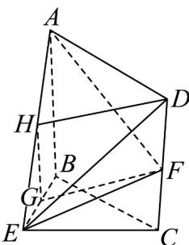
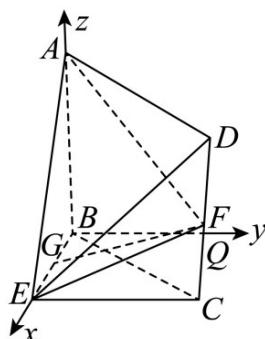

> [!faq]- 《专题21 立体几何大题综合》真题解析
>
> > [!success]- **【答案】** 详见解析
>
> > [!note]- **【分析】**
> > （1）取 $AE$ 的中点 $H$ ，连接 $HG$ ，HD，通过证明四边形 $HGFD$ 是平行四边形来证明 $GF//DH$ ，由线面平行的判定定理可得；
> >
> > (2) 以 B 为原点，分别以 $\overline{BE}$ $\overline{BQ}$ $\overline{BA}$ 的方向为 x 轴，y 轴，z 轴的正方向建立空间直角坐标系，可得平面 BEC 和平面 AEF 的法向量，由向量夹角的余弦值可得.
>
> > [!note]- **【解析】**
> > （1）如图，取 $AE$ 的中点 $H$ 连接 $HG$ ， $HD$ ，又 $G$ 是 $BE$ 的中点，
> > 
> > 所以 $HG // AB$ ，且 $HG = \frac{1}{2} AB$
> > 又 $F$ 是 $CD$ 中点，所以 $DF = \frac{1}{2} CD$
> > 由四边形 $ABCD$ 是矩形得， $AB // CD$ ， $AB = CD$
> > 所以 GH // DF 且 GH = DF .
> > 从而四边形 HGFD 是平行四边形，所以 GF//DH
> > $\because DH \subset \text{平面 } ADE, GF \notin \text{平面 } ADE, \therefore GF // \text{ 平面 } ADE.$
> > (2) 如图，在平面 BEC 内，过点 B 作 $BQ \parallel EC$ ，因为 $BE \perp CE$ ，所以 $BE \perp BQ$ 。
> > 又 $AB \perp$ 平面 BEC，BE， $BQ \subset$ 平面 BEC，所以 $AB \perp BE$ ， $AB \perp BQ$ 。
> > 
> > 以 B 为原点，分别以 $\overline{BE}$ ， $\overline{BQ}$ ， $\overline{BA}$ 的方向为 x 轴，y 轴，z 轴的正方向建立空间直角坐标系，设 AB = 4，
> > 则 $A(0,0,4)$ ， $B(0,0,0)$ ， $E(4,0,0)$ ， $F(4,4,2)$ .
> > 因为 $AB \perp$ 平面 BEC，所以 $\overline{BA} = (0, 0, 4)$ 为平面 BEC 的法向量，
> > 设 $n = (x, y, z)$ 为平面 $AEF$ 的法向量。又 $AE = (4, 0, -4)$ ， $AF = (4, 4, -2)$
> > $\left\{ \begin{array}{l} n \cdot AE = 0 \\ \rightarrow \square \square \\ n \cdot AF = 0 \end{array} \right.$ 即 $\left\{ \begin{array}{l} 4x - 4z = 0 \\ 4x + 4y - 2z = 0 \end{array} \right.$ ，取 $n = (2, -1, 2)$ ，
> > $\therefore \cos <\stackrel{\square\square}{BA}$ ， $n>=\frac{\stackrel{\square\square}{BA}\cdot n}{\left|BA\right|\left|n\right|}=\frac{2\times4}{4\times3}=\frac{2}{3}$
> > 所以平面 AEF 与平面 BEC 所成锐二面角的余弦值为 $\frac{2}{3}$ .
> > 【点睛】
